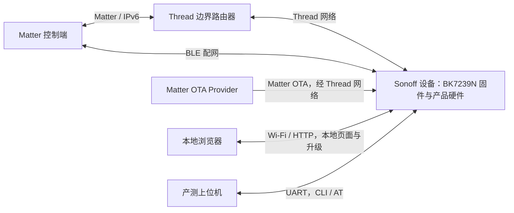
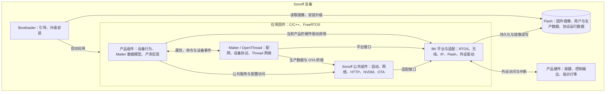

# 仓库整体设计说明

依据：2026-09-09 工作区源码，当前产品为 `onoff_plug`，目标平台为 `BK7239N`。本文按 C4 的系统边界、运行单元和组件职责说明整体设计；接口、状态机与底层流程放在各模块文档中。

**仓库采用“产品实现 + Sonoff 公共能力 + 芯片 SDK”的组织方式，通过统一构建入口组装产品固件。当前产品以 Matter over Thread 承载设备控制，同时提供独立的 Wi-Fi、HTTP、存储、产测接入和 OTA 能力。**

## 1. 系统定位与外部交互

系统边界是 Sonoff 设备。设备负责本地执行、协议接入、数据持久化和升级；控制端、网络基础设施与产测工具位于设备之外。

图中表示业务交互，OTA Provider 到设备的实际网络路径也可经过边界路由器。

当前 [Matter 构建配置](../build_tool/matter/args.gni) 启用 Thread 和 BLE 配网，关闭 Matter 的 Wi-Fi 接入；[平台配置](../build_tool/config/bk7239n/config) 同时启用 Wi-Fi 与无线共存能力。因此，**Matter/Thread 与 Sonoff Wi-Fi 管理是固件内两条不同的网络路径**，共同使用底层芯片资源。

## 2. 运行结构

设备包含 Bootloader、应用固件和 Flash 存储。产品代码、Sonoff 公共组件、Matter/OpenThread 与 BK SDK 最终链接到应用固件中，通过 FreeRTOS 任务、回调及函数调用协作。

图中应用内部节点是组件分组。主任务、Wi-Fi、HTTP、OTA 等任务属于同一固件的执行单元；模块也可以同步执行，例如 NVDM 读写。当前主任务负责部分业务事件衔接，Matter/OpenThread 保留各自的事件处理机制。

## 3. 仓库分层与职责

| 目录 | 设计职责 | 主要内容 |
| --- | --- | --- |
| [project/](../project/) | 承载产品差异 | 当前只有 `onoff_plug`：型号与版本配置、产品私有存储项、产测实现、Matter 数据模型及设备控制 |
| [sonoff/](../sonoff/) | 提供公共能力 | 启动入口、主任务、CLI、网络/Wi-Fi、HTTP、NVDM、OTA，以及日志、编码和加密工具 |
| [bk_openthread/](../bk_openthread/) | 提供平台与协议基础 | 顶层 SDK 子模块，包含 BK IDK、Matter、OpenThread 和平台适配代码 |
| [sonoff_modify/](../sonoff_modify/) | 保存 SDK 定制 | 对 IDK、Matter、OpenThread、adapter 的覆盖文件，保持与目标目录相同的相对路径 |
| [build_tool/](../build_tool/) | 统一产品构建与打包 | 工程组装、芯片配置、分区/打包配置、Matter 构建及签名相关工具 |
| [docs/](./) | 保存设计与专题说明 | 整体架构、模块设计、安全启动与签名方案 |

这些目录体现三个主要设计取向：

- **产品差异集中管理。** 构建按 `MODEL` 选择产品，复用公共组件与 SDK；产品提供自己的配置、数据模型和业务实现。
- **公共逻辑与平台调用分离。** 网络、Wi-Fi、OTA 等模块通过适配层对接 BK SDK；Matter 的生产数据和 OTA 则通过定制桥接复用 Sonoff 能力。
- **SDK 定制单独维护。** 构建时将 `sonoff_modify` 覆盖到对应 SDK 目录，使定制内容有明确的维护位置。

当前分层仍保留直接依赖：产品的 Matter 设备控制代码直接调用 BK GPIO 等接口；部分公共组件也会直接使用产品配置头文件。`sonoff/private` 中的设备接口尚未形成统一硬件抽象，后续扩展产品时可继续完善这一边界。

## 4. 设备运行主线

启动入口见 [sonoff_entry.c](../sonoff/entry/sonoff_entry.c)，宏观流程如下：

1. **平台准备：** SDK 初始化系统资源，进入 Sonoff 启动流程。
2. **基础数据准备：** 初始化 NVDM、应用生产 MAC、注册 CLI，再根据 License 校验结果和产测握手决定运行模式。
3. **产测模式：** 保留串口交互，进入产品产测入口。当前产测任务仍为基础框架，具体测试流程尚待产品实现。
4. **正常模式：** 关闭本地控制台接收，启动主任务与网络管理，按配置启动 Matter，再初始化 OpenThread，进入事件驱动的设备运行阶段。

正常运行围绕三条主线展开：

| 主线 | 宏观路径 |
| --- | --- |
| 设备控制 | Matter 命令更新属性，由产品回调驱动控制输出；本地按键也通过产品逻辑更新 Matter 属性 |
| 本地服务 | Wi-Fi/AP 提供网络接入，HTTP 提供本地页面与升级入口，主任务衔接 AP 就绪后的服务启动 |
| 固件升级 | HTTP 上传或 Matter 下载进入统一 OTA 核心，写入暂存区，提交并重启后由 Bootloader 安装 |

持久化数据按责任划分：NVDM 管理用户配置、工厂信息和 Matter 生产数据；Matter/OpenThread 保存各自的协议运行数据；应用镜像与 OTA 暂存区单独管理。各类数据的清理、升级保留范围由对应模块定义。

## 5. 构建与交付设计

统一入口是 [build_tool/Makefile](../build_tool/Makefile)，以 `MODEL` 选择产品、`SOC` 选择平台。构建过程为：

1. 在 `build/project_tree/<MODEL>` 组装工程，将公共代码、产品代码和公共配置关联到 SDK 所需的目录结构。
2. 应用四组 SDK 覆盖文件：`idk_modify`、`matter_modify`、`openthread_modify`、`adapter_modify`。
3. CMake/Armino 编译公共 C 代码和产品 C 代码；Matter 使用 GN/Ninja 编译协议栈、产品 C++ 代码及 ZAP 数据模型，再链接进应用。
4. SDK 根据所选配置生成固件和升级包，输出集中到 `build/`；构建脚本退出时执行 SDK 恢复逻辑。

`build/` 是生成目录，源代码维护位置仍为 `project/`、`sonoff/` 和 `sonoff_modify/`。当前恢复逻辑会对 SDK 工作树执行 Git 恢复，SDK 定制应保存在覆盖目录中。

安全启动、签名和 KMS 接入作为独立交付专题演进。仓库已有相关配置、工具及覆盖文件，但当前产品 `config` 中的安全启动选项仍为注释状态；本文不将安全升级链列为已经完成板端验证的能力。

## 6. 模块文档导航

| 文档 | 承接的细节 |
| --- | --- |
| [OTA 流程与方案](ota.md) | HTTP/Matter 接入、统一会话、写入与升级安装流程 |
| [NVDM 数据存储与读取](nvdm.md) | 数据分组、默认值、读写接口、清理范围与产品扩展 |
| [网络管理与 Wi-Fi 管理](network_wifi.md) | 两层职责、STA/AP、扫描、状态机与异步回调 |
| [Matter 生产数据](../sonoff/nvdm/matter_factory_data.md) | 生产数据、配网参数及凭据接入 |
| [安全启动与 OTA 迁移](secure_boot_ota_migration.md) | 安全启动、升级策略与迁移边界 |
| [安全签名配置](secure_boot_signing_setup.md) | 签名配置、可信公钥绑定与验证步骤 |

后续可补充启动与产测、Matter 产品接入、HTTP 服务、产品硬件控制等模块文档。总览维护系统边界、组件关系和交付主线；UML 时序、状态与代码细节在模块文档中展开。
