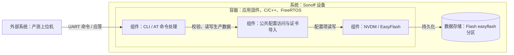
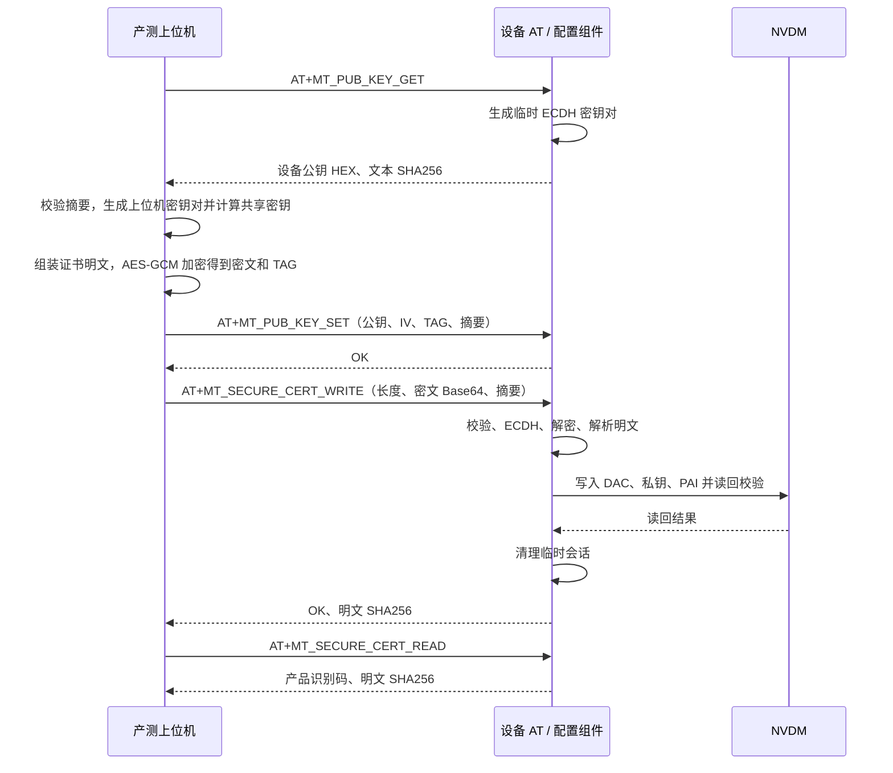

# 产测 AT 指令手册

本文面向产测人员和产测上位机开发者，整理设备进入产测模式、生产数据写入、读回校验及返工操作。内容依据 [at.md](at.md)，并与当前命令处理和 NVDM 实现核对；项目相关示例采用 `project/onoff_plug`。

当前接口包括 **19 条 AT 指令**，另有 `AT` 帮助命令和启动握手 `factory!`。这些指令用于设备身份、License 和 Matter 生产数据配置；当前演示项目尚未通过这些 AT 指令提供继电器、按键等硬件测试功能。

## 1. 接入与产测流程

### 1.1 系统边界（C4）

产测上位机是设备外部系统，通过固件控制台 UART 发送命令。设备内部由 CLI 解析命令、公共配置组件完成字段校验和密码运算，NVDM 将生产数据写入 Flash。ECDH 临时会话仅保存在 RAM。



### 1.2 串口与报文约定

| 项目 | 约定 |
| --- | --- |
| 串口 | 使用当前固件的控制台 UART；端口、引脚、波特率及串口参数按实际板卡配置设置 |
| 行结束 | 每条命令以 CRLF 结束，即字节 `0D 0A`；本文的 `\r\n` 表示实际换行字节 |
| 命令名称 | 按表中大小写发送；只有明确带 `?` 的命令才追加 `?` |
| 参数 | 通常以 `=` 引出，以 `,` 分隔；不要额外添加空格或空参数 |
| 文本与长度 | 长度以字节计，不包含字符串结束符、命令前缀或 CRLF；具体覆盖范围见各命令 |
| HEX | 十六进制文本，不带 `0x`；输入摘要支持大小写，参与摘要计算的原始文本必须保持原样 |
| Base64 | 使用标准 Base64，保留末尾 `=` 填充，不换行；CD 和安全证书的 Base64 参数不加引号 |
| 普通成功应答 | `AT+CMD=<value>\r\n`，写入或删除通常返回 `AT+CMD=OK\r\n` |
| 普通失败应答 | `AT+CMD=ERROR\r\n`；License 写入另有一行错误原因 |
| 查询应答名称 | 去掉请求中的 `?`，例如 `AT+LICENSE_READ?` 对应 `AT+LICENSE_READ=...` |
| 请求调度 | 一次只发送一条命令，收齐应答后再发送下一条；没有统一的独立 `OK` 结束行 |

当前 SDK CLI 使用命令后的 `=` 分隔命令和参数；参数中的 Base64 填充 `=` 会保留。空格和逗号参与参数切分；Matter 工厂数据中的名称若含空格，应使用双引号包住整个字段，例如 `"SONOFF Plug"`，摘要按去掉外围引号后的字段值计算。License 使用第 4 节的紧凑 JSON 格式，不给整个 JSON 再包一层引号。

控制台可能同时输出命令回显、提示符和日志。上位机应按预期命令的应答前缀识别结果，不能把“收到一行”或提示符当作命令成功。语法错误或未注册命令可能由 SDK CLI 直接报错，不保证返回上述 AT 错误格式。

### 1.3 进入产测模式

| 上电时的状态 | 设备行为 | 上位机操作 |
| --- | --- | --- |
| License 缺失或无效 | 直接调用私有项目产测入口 | 等待 `factory mode\r\n` |
| License 有效 | 连续输出 3 次 `factory?\r\n`，随后等待约 3000 ms | 在等待窗口内发送 `factory!\r\n`，再等待 `factory mode\r\n` |
| 有效 License，握手超时 | 关闭本地控制台 UART 接收，进入正常业务 | 重新上电或复位，在下一次启动窗口内握手 |

当前 `onoff_plug` 的产测入口会输出 3 次 `factory mode\r\n`。`factory!` 没有 `OK` 应答，应以进入产测的提示为准。等待窗口是在第 3 次 `factory?` 输出后才建立；过早发出的应答可能被忽略，上位机可在启动窗口内以短间隔重试，看到 `factory mode` 后停止。

**License 有效只是当前启动分支的判断条件，不代表授权码、Matter 工厂数据或证书已全部配置完成。** 当前 AT 列表没有退出产测或复位指令；完成配置后由工装复位设备，不回复下一轮 `factory?`，设备即可进入正常业务。

### 1.4 推荐生产顺序

| 步骤 | 操作 | 通过条件 |
| --- | --- | --- |
| 1 | 上电进入产测，查询 `AT+FW_VER?`，必要时发送 `AT` | 进入产测模式，固件版本符合工单 |
| 2 | 写入并查询产品识别码 | 14 位识别码与工单一致 |
| 3 | 写入 License，再查询 `AT+LICENSE_READ?` | 收齐写入结果和 3 行 C5 摘要，读回型号、UIID、C5 一致 |
| 4 | 查询 `AT+MASTER_CHIP_ID?`，生成并写入授权码，再查询授权状态 | 记录芯片 OTP 原始 MAC 派生的 UID，授权状态为 `OK` |
| 5 | 写入 Matter 工厂数据并读回 | 9 个可读字段与工单一致，READ 摘要正确 |
| 6 | 写入并读回 CD | Base64 长度、解码后内容及二进制摘要一致 |
| 7 | 建立 ECDH 会话，写入安全证书，再查询证书状态 | 明文摘要与工单一致，返回的识别码正确 |
| 8 | 工装复位，按产品要求进行正常功能验证 | 生产数据重启后仍有效，业务功能符合产品要求 |

步骤 5～7 可按产线安排调整；证书状态查询前必须已有有效的产品识别码。License 中的 BASE MAC 仍在下次启动时应用，但芯片 ID 和授权码使用独立的 OTP 原始 MAC，无需在生成授权码前额外复位，改变 License BASE MAC 也不会改变芯片 ID。

## 2. 指令速查

下表中的无参数命令应直接追加 CRLF；写入命令的完整参数见后文。

| 分类 | 命令 | 功能 | 成功应答内容 |
| --- | --- | --- | --- |
| 身份 | `AT+MASTER_CHIP_ID?` | 查询 OTP 原始 MAC 派生的芯片标识 | `BK723x-` 加 32 位大写 HEX |
| 身份 | `AT+FW_VER?` | 查询固件版本 | 固件版本字符串 |
| 身份 | `AT+MT_SERIAL_NUM?` | 查询产品识别码 | 14 位数字 |
| 身份 | `AT+MT_SERIAL_NUM_SET` | 写入产品识别码 | `OK` |
| 授权 | `AT+ACTIVE_CODE` | 写入授权码 | `OK` |
| 授权 | `AT+ACTIVE_CODE?` | 验证已存授权码 | `OK` |
| License | `AT+LICENSE_WRITE` | 写入 License JSON | `OK`，另有 3 行 SHA256 |
| License | `AT+LICENSE_READ?` | 查询 License | UIID、型号、C5 摘要 |
| License | `AT+LICENSE_DELETE` | 清除 License 的 5 个字段 | `OK` |
| Matter | `AT+MT_FACTORY_DATA_WRITE` | 写入 10 个工厂字段 | `OK` |
| Matter | `AT+MT_FACTORY_DATA_READ` | 读取 9 个工厂字段 | 9 个字段及摘要，不含 passcode |
| CD | `AT+MT_CD_WRITE` | 写入 Certification Declaration | `OK` |
| CD | `AT+MT_CD_READ` | 读取 CD | 共 3 行：长度、Base64、SHA256 |
| CD | `AT+MT_CD_DELETE` | 清除 CD | `OK` |
| 安全证书 | `AT+MT_PUB_KEY_GET` | 生成设备临时 ECDH 公钥 | 公钥 HEX、文本摘要 |
| 安全证书 | `AT+MT_PUB_KEY_SET` | 设置上位机公钥、IV、TAG | `OK` |
| 安全证书 | `AT+MT_SECURE_CERT_WRITE` | 加密导入 DAC、私钥、PAI | `OK`，另有 1 行明文 SHA256 |
| 安全证书 | `AT+MT_SECURE_CERT_READ` | 查询安全证书状态 | 产品识别码、明文 SHA256 |
| 安全证书 | `AT+MT_SECURE_CERT_DELETE` | 清除 DAC、私钥、PAI | `OK` |

发送 `AT\r\n` 会逐行列出以上 19 个注册命令名，没有额外的 `AT=OK` 应答。

## 3. 设备身份与授权

### 3.1 查询芯片标识

```text
发送：AT+MASTER_CHIP_ID?\r\n
成功：AT+MASTER_CHIP_ID=BK723x-<32位大写HEX>\r\n
失败：AT+MASTER_CHIP_ID=ERROR\r\n
```

UID 共 16 字节，前 6 字节是通过 `bk_get_original_mac()` 读取的芯片 OTP 原始 MAC，后 10 字节为 `00`。前缀固定为 `BK723x`，不随项目的固件版本字符串变化。例如 OTP 原始 MAC 为 `02:00:00:00:00:01` 时：

```text
AT+MASTER_CHIP_ID=BK723x-02000000000100000000000000000000\r\n
```

该标识不受 License 或运行时 BASE MAC 覆盖影响。BK7239N 固定读取 OTP2 的 `OTP_MAC_ADDRESS1` 项前 6 字节，该项必须已配置有效且唯一的 MAC；读取失败、全零或组播/广播地址均返回 `ERROR`，不回退到其他 MAC 项、Flash、随机或默认 MAC。生成授权码时，应解码连字符后的 32 位 HEX 得到 16 字节 UID，不使用前缀，也不直接加密 HEX 文本。

### 3.2 查询固件版本

```text
发送：AT+FW_VER?\r\n
成功：AT+FW_VER=FWSW-SERIAL-SWITCH-BK7239N-v1.1.2\r\n
失败：AT+FW_VER=ERROR\r\n
```

版本格式为 `FW{CLASS}-{SERIAL}-{FUNCTION}-{CHIP}-v{VERSION}`，由私有项目配置拼装。上述为当前 `onoff_plug` 示例，使用 `SONOFF_SOFTWARE_VERSION_STRING`，与 Matter 的软件版本配置分别维护。

### 3.3 产品识别码

识别码是恰好 14 位的十进制数字字符串，允许前导零；上位机应按字符串保存。

```text
发送：AT+MT_SERIAL_NUM_SET=12345678901234\r\n
成功：AT+MT_SERIAL_NUM_SET=OK\r\n
失败：AT+MT_SERIAL_NUM_SET=ERROR\r\n

发送：AT+MT_SERIAL_NUM?\r\n
成功：AT+MT_SERIAL_NUM=12345678901234\r\n
失败：AT+MT_SERIAL_NUM=ERROR\r\n
```

SET 会写入 Flash；QUERY 在未写入、格式无效或读取失败时返回 `ERROR`。

### 3.4 授权码

```text
发送：AT+ACTIVE_CODE=<32位HEX授权码>\r\n
成功：AT+ACTIVE_CODE=OK\r\n
失败：AT+ACTIVE_CODE=ERROR\r\n

发送：AT+ACTIVE_CODE?\r\n
成功：AT+ACTIVE_CODE=OK\r\n
失败：AT+ACTIVE_CODE=ERROR\r\n
```

当前授权码算法为：

```text
明文 = OTP 原始 MAC 的 6 字节 || 10 字节 0x00
密钥 = ASCII("soNoFF22soNoFF22")，共 16 字节
密文 = AES-128-ECB(密钥, 明文)，单个 16 字节块，无额外填充
授权码 = HEX(密文)，共 32 个字符
```

写入前，设备按当前 UID 计算授权码并比较，匹配后才写 Flash。查询会重新验证已有授权码，不返回授权码内容；未写入或与当前 UID 不匹配均返回 `ERROR`。License 查询成功不能替代此项检查。

## 4. License 指令

### 4.1 写入格式与字段

```text
发送：AT+LICENSE_WRITE=<len>,<json>\r\n
```

`len` 是整包紧凑 JSON 的字节数，范围为 1～512。JSON 必须单行发送，不添加用于排版的空格或换行。下面仅为结构展示：

```json
{
  "license_frame_len": 150,
  "license_frame": {
    "deviceid": "0000000001",
    "factory_apikey": "00000000-0000-4000-8000-000000000001",
    "base_mac": "02:00:00:00:00:01",
    "device_model": "onoff_plug",
    "uiid": 77
  },
  "sha256_check": "7f690fdee0d77166a651dbc30bb437a2390604118c0ddc1e4d9cd738717002f4"
}
```

| 字段 | 规则 |
| --- | --- |
| `license_frame_len` | `license_frame` 对象紧凑序列化后的字节数，包含对象两端 `{}`；不是整包 JSON 长度 |
| `deviceid` | 长度为 10 字节的字符串；与 14 位产品识别码是不同字段 |
| `factory_apikey` | 36 字符，HEX 与连字符组成的 `xxxxxxxx-xxxx-xxxx-xxxx-xxxxxxxxxxxx` 格式 |
| `base_mac` | 17 字符，例如 `02:00:00:00:00:01`；拒绝全零地址和组播地址 |
| `device_model` | 必须与固件 `SONOFF_DEVICE_MODEL` 完全一致，当前演示项目为 `onoff_plug` |
| `uiid` | JSON 数字；产测端使用 0～2147483647 的十进制整数，禁止小数和超界值，当前固件通过 `cJSON.valueint` 取值 |
| `sha256_check` | 64 位 HEX，使用下述 C1 规则计算 |

使用上述 ASCII 数据时，内层长度为 **150**，整包长度为 **274**。所有值仅作协议示例，实际生产应替换为工单数据，并重新计算长度和摘要：

```text
AT+LICENSE_WRITE=274,{"license_frame_len":150,"license_frame":{"deviceid":"0000000001","factory_apikey":"00000000-0000-4000-8000-000000000001","base_mac":"02:00:00:00:00:01","device_model":"onoff_plug","uiid":77},"sha256_check":"7f690fdee0d77166a651dbc30bb437a2390604118c0ddc1e4d9cd738717002f4"}\r\n
```

### 4.2 摘要与成功应答

以下 `+` 表示直接拼接字段值，不插入分隔符。`uiid` 转成无前导零的十进制文本；JSON 的键名、引号和花括号均不参与这两个摘要。

```text
C1 = SHA256(factory_apikey + base_mac + device_model + uiid + deviceid)
C5 = SHA256(deviceid + factory_apikey + base_mac + device_model + uiid)
```

请求中的 `sha256_check` 使用 C1。设备写入并读回，通过 C1 校验后，返回以下 **4 行**，后三行是同一个 C5：

```text
AT+LICENSE_WRITE=OK\r\n
SHA256=<C5的64位HEX>\r\n
SHA256=<C5的64位HEX>\r\n
SHA256=<C5的64位HEX>\r\n
```

第 4.1 节示例对应的 C5 为 `e1869dd33653b1c862ade82c170b8c6051e614176899eabdbaf0647bfdc1c235`。上位机应收齐全部应答，并将 C5 与本地计算结果比较。

### 4.3 错误应答

失败时共 2 行，第一行固定为 `AT+LICENSE_WRITE=ERROR\r\n`，第二行为下表中的完整错误文本，再追加 CRLF。

| 第二行文本 | 当前实现中的含义 |
| --- | --- |
| `FAILED OPERATE:NON LICENSE FRAME` | 缺少长度或 JSON 参数 |
| `FAILED OPERATE:LICENSE ALREADY` | 设备已存在有效 License，拒绝覆盖 |
| `FAILED PARAM:NON COMPLIANCE WITH LICENSE RULES` | 整包长度非法或不符、JSON 无法解析、字段类型或格式不符合要求 |
| `FAILED PARAM:FRAMER LEN MISMATCHING` | 内层 `license_frame_len` 与紧凑对象长度不符 |
| `FAILED PARAM:FRAMER SHA256 CHECK MISMATCHING` | C1 传输校验或写后读回校验不符 |
| `FAILED PARAM:DEVICE MODEL MISMATCHING` | 型号与固件项目配置不一致 |
| `HARDWARE FAILED:STORAGE HARDWARE` | 清理、存储或其他内部处理失败，需要结合设备日志定位 |

当前处理顺序是：检查整包长度 → 拒绝已存在的有效 License → 清空旧 License 字段 → 解析、校验、逐项写入、读回。写入失败不保证旧的不完整数据保留，也不提供跨字段回滚。

### 4.4 查询与删除

```text
发送：AT+LICENSE_READ?\r\n
成功：AT+LICENSE_READ=<UIID>,<device_model>,<C5的64位HEX>\r\n
失败：AT+LICENSE_READ=ERROR\r\n

发送：AT+LICENSE_DELETE\r\n
成功：AT+LICENSE_DELETE=OK\r\n
失败：AT+LICENSE_DELETE=ERROR\r\n
```

查询返回已存字段组成的 C5，应与工单预期值比较。删除仅清空 `deviceid`、`factory_apikey`、`base_mac`、`device_model`、`uiid` 对应的 5 个 License 项；不清除产品识别码、授权码、Matter 工厂数据、CD 或安全证书。无 License 时仍执行清空操作。

遇到 `LICENSE ALREADY` 时，先查询并确认是否为该设备的预期数据；只有确定返工重写时才执行 DELETE，再重新写入。

## 5. Matter 工厂数据

### 5.1 写入

```text
AT+MT_FACTORY_DATA_WRITE=<discriminator>,<iteration.count>,<salt>,<verifier>,<vendor.id>,<vendor.name>,<product.id>,<product.name>,<rd.id.uid>,<passcode>,<sha256>\r\n
```

必须按顺序传入 10 个字段和 1 个摘要，不能省略字段。

| 序号 | 字段 | 接口格式与长度 |
| --- | --- | --- |
| 1 | `discriminator` | 0～4095，十进制，最多 4 字符 |
| 2 | `iteration.count` | 无符号 32 位十进制整数，最多 10 字符 |
| 3 | `salt` | 非空 Base64 文本，最多 44 字符 |
| 4 | `verifier` | 非空 Base64 文本，最多 132 字符 |
| 5 | `vendor.id` | 1～4 位 HEX，不带 `0x` |
| 6 | `vendor.name` | 1～32 字节可打印 ASCII，不含逗号；含空格时用外围双引号保护 |
| 7 | `product.id` | 1～4 位 HEX，不带 `0x` |
| 8 | `product.name` | 同 `vendor.name` |
| 9 | `rd.id.uid` | 恰好 32 位 HEX |
| 10 | `passcode` | 无符号 32 位十进制整数，最多 10 字符 |
| 11 | `sha256` | 下述拼接文本的 SHA-256，64 位 HEX |

上表描述固件接口的格式检查范围；实际 Matter 参数应由生产数据生成流程提供。写入 `OK` 不代表参数之间的关系或配网可用性已经验证。

摘要输入是 **10 个原始字段值各追加一个逗号后依次拼接**，包括 passcode 后的最后一个逗号：

```text
SHA256(discriminator + "," + iteration.count + "," + salt + "," + verifier + ","
     + vendor.id + "," + vendor.name + "," + product.id + "," + product.name + ","
     + rd.id.uid + "," + passcode + ",")
```

```text
成功：AT+MT_FACTORY_DATA_WRITE=OK\r\n
失败：AT+MT_FACTORY_DATA_WRITE=ERROR\r\n
```

设备先校验摘要，再依次校验、写入各字段；后面的字段失败时，前面的字段可能已经写入。重试应发送完整的 10 字段数据，并重新读回核对。

### 5.2 读取

```text
发送：AT+MT_FACTORY_DATA_READ\r\n
成功：AT+MT_FACTORY_DATA_READ=<discriminator>,<iteration.count>,<salt>,<verifier>,<vendor.id>,<vendor.name>,<product.id>,<product.name>,<rd.id.uid>,<sha256>\r\n
失败：AT+MT_FACTORY_DATA_READ=ERROR\r\n
```

读取返回 **9 个字段，不含 passcode**。`vendor.id` 和 `product.id` 统一输出 4 位大写 HEX，数值字段输出十进制文本。READ 摘要覆盖返回的这 9 个字段和每个字段后的逗号，即从第一个字段到摘要前的最后一个逗号。

WRITE 与 READ 的摘要输入不同，不能直接比较两者摘要；应使用本次返回的文本重新计算 READ 摘要，并逐项核对内容。READ 成功也不证明 passcode 已写入或有效。

## 6. Matter CD

### 6.1 写入

```text
发送：AT+MT_CD_WRITE=<len>,<CD_Base64>,<sha256>\r\n
成功：AT+MT_CD_WRITE=OK\r\n
失败：AT+MT_CD_WRITE=ERROR\r\n
```

`len` 是 Base64 文本字节数，包含末尾填充 `=`；`sha256` 对 **Base64 解码后的 CD 二进制**计算。长度、Base64 解码、摘要和存储均通过后才返回 `OK`。

当前 Base64 文本上限为 **512 字符**。虽然二进制缓冲上限也是 512 字节，但受文本上限约束，标准 Base64 实际最多承载 **384 字节 CD**；准备生产数据时应同时满足两项限制。

### 6.2 读取与删除

```text
发送：AT+MT_CD_READ\r\n
成功，共3行：
AT+MT_CD_READ=<Base64文本字节数>\r\n
<CD_Base64>\r\n
SHA256=<CD二进制的64位HEX摘要>\r\n

失败：AT+MT_CD_READ=ERROR\r\n

发送：AT+MT_CD_DELETE\r\n
成功：AT+MT_CD_DELETE=OK\r\n
失败：AT+MT_CD_DELETE=ERROR\r\n
```

读取后应核对文本长度、解码后的内容与摘要。删除只清空 CD 项，不影响 DAC、DAC 私钥和 PAI；原先未写入时仍执行清空操作。

## 7. Matter 安全证书

### 7.1 导入顺序（UML）

“服务端公钥”指产测上位机或其证书服务用于本次 ECDH 会话的公钥；设备通过 AT 接收这些参数，无需自行连接证书服务。



该图展示成功路径。会话不持久化；设备重启或重新 GET 公钥后，必须重新计算加密数据并 SET 参数。为统一处理失败重试，每次证书写入尝试后如需重试，应重新执行 GET → SET → WRITE。

### 7.2 获取设备公钥

```text
发送：AT+MT_PUB_KEY_GET\r\n
成功：AT+MT_PUB_KEY_GET=<device_pub_hex>,<sha256>\r\n
失败：AT+MT_PUB_KEY_GET=ERROR\r\n
```

曲线为 P-256 / `secp256r1`。返回公钥是未压缩的 65 字节 `04 || X || Y`，编码为 **130 个小写 HEX 字符**。摘要覆盖返回的这 130 个文本字节，而非解码后的 65 字节公钥。

每次调用会重新生成临时密钥，并清除上一组本地密钥及已设置的服务端参数；它不是无副作用的重复查询。

### 7.3 设置上位机公钥与解密参数

```text
发送：AT+MT_PUB_KEY_SET=<server_pub_hex>,<iv_hex>,<tag_hex>,<sha256>\r\n
成功：AT+MT_PUB_KEY_SET=OK\r\n
失败：AT+MT_PUB_KEY_SET=ERROR\r\n
```

| 参数 | 格式 |
| --- | --- |
| `server_pub_hex` | P-256 未压缩公钥，130 位 HEX，解码后首字节为 `04` |
| `iv_hex` | AES-GCM IV，12 字节，对应 24 位 HEX |
| `tag_hex` | AES-GCM 认证标签，16 字节，对应 32 位 HEX |
| `sha256` | `SHA256(server_pub_hex + "," + iv_hex + "," + tag_hex)`，64 位 HEX |

此摘要按参数的原始文本计算，**末尾不加逗号**。公钥、IV 和 TAG 的 HEX 大小写变化也会改变此文本摘要。SET 参数只存于 RAM，后续 WRITE 才使用它们进行 ECDH 和解密。

### 7.4 证书明文和加密格式

先构造以下二进制明文，所有长度均是对应二进制数据的字节数：

| 偏移 | 内容 | 长度 / 编码 |
| --- | --- | --- |
| 0 | DAC 证书长度 | `uint32`，小端序 |
| 4 | DAC 私钥长度 | `uint32`，小端序，值必须为 32 |
| 8 | PAI 证书长度 | `uint32`，小端序 |
| 12 | DAC 证书 | DER，1～600 字节 |
| `12 + DAC长度` | DAC 私钥 | 原始私钥，32 字节，不是 PEM 或 DER 容器 |
| `12 + DAC长度 + 32` | PAI 证书 | DER，1～600 字节 |

明文总长必须等于 `12 + DAC长度 + 32 + PAI长度`，最多 **1244 字节**。例如上位机可用 `struct.pack("<III", len(dac), 32, len(pai)) + dac + dac_key + pai` 组装明文。

加密规则：

1. 用上位机临时私钥和设备公钥执行 ECDH，得到 32 字节共享密钥。
2. 直接将这 32 字节作为 AES-256-GCM 密钥；当前协议没有额外 KDF 或 SHA-256 派生步骤。
3. 使用本次设置的 12 字节 IV，AAD 为空，加密完整明文，得到密文和 16 字节 TAG。
4. TAG 经 PUB_KEY_SET 单独发送；**只对密文做 Base64 编码，不拼接 TAG**。Base64 最多 1660 字符。

### 7.5 写入安全证书

```text
发送：AT+MT_SECURE_CERT_WRITE=<len>,<cipher_Base64>,<sha256>\r\n
成功，共2行：
AT+MT_SECURE_CERT_WRITE=OK\r\n
SHA256=<完整证书明文的64位HEX摘要>\r\n

失败：AT+MT_SECURE_CERT_WRITE=ERROR\r\n
```

`len` 是密文 Base64 文本字节数，包括填充 `=`。请求摘要对 **密文 Base64 文本**计算；应答摘要对 **完整证书明文**计算，包含 12 字节长度头、DAC、私钥和 PAI。上位机应提前保存明文摘要，并校验最终应答。

设备会校验输入、计算共享密钥、验证 GCM TAG、解析明文长度，逐项写入证书并读回校验。写入过程中失败可能留下部分更新或触发证书组清空，不能假设旧证书始终保留。

### 7.6 查询与删除

```text
发送：AT+MT_SECURE_CERT_READ\r\n
成功：AT+MT_SECURE_CERT_READ=<14位产品识别码>,<完整证书明文的64位HEX摘要>\r\n
失败：AT+MT_SECURE_CERT_READ=ERROR\r\n

发送：AT+MT_SECURE_CERT_DELETE\r\n
成功：AT+MT_SECURE_CERT_DELETE=OK\r\n
失败：AT+MT_SECURE_CERT_DELETE=ERROR\r\n
```

READ 从已存 DAC、私钥和 PAI 重建同样的长度头与明文，计算摘要；不输出私钥或证书内容。有效产品识别码和完整证书数据缺一不可。DELETE 只清空 DAC、DAC 私钥、PAI 三项，不删除 CD，也不清除产品识别码。

## 8. 上位机校验与异常处理

### 8.1 SHA-256 输入速查

所有摘要输出均为 32 字节摘要编码成的 64 位 HEX；计算时不包含命令前缀、摘要字段本身、CRLF 或 NUL。

| 场景 | SHA-256 的输入 | 末尾逗号 |
| --- | --- | --- |
| License WRITE 请求 C1 | API Key、BASE MAC、型号、UIID、deviceid 的值直接拼接 | 无分隔符 |
| License WRITE 应答 / READ 的 C5 | deviceid、API Key、BASE MAC、型号、UIID 的值直接拼接 | 无分隔符 |
| Matter 工厂数据 WRITE | 10 个字段，每个字段后追加逗号 | **有** |
| Matter 工厂数据 READ | 本次返回的 9 个字段，每个字段后追加逗号 | **有** |
| CD WRITE / READ | Base64 解码后的 CD 二进制 | 不适用 |
| PUB_KEY_GET | 返回公钥的 130 字符 HEX 文本 | 无 |
| PUB_KEY_SET | `公钥HEX,IV_HEX,TAG_HEX` 文本 | **无** |
| SECURE_CERT_WRITE 请求 | 密文 Base64 文本，含填充 `=` | 无 |
| SECURE_CERT_WRITE 应答 / READ | 12 字节长度头及其后的 DAC、私钥、PAI 二进制明文 | 不适用 |

### 8.2 接收与重试

| 现象 | 建议处理 |
| --- | --- |
| 有启动日志，但 AT 无应答 | 检查是否错过产测握手窗口；正常业务已关闭控制台接收时需要复位 |
| 长度或摘要错误 | 区分文本 / 二进制、内层 / 外层长度、是否包含填充、是否需要末尾逗号 |
| 查询失败 | 先检查数据是否已写全、格式是否有效，再结合日志判断存储错误 |
| 写入超时，结果未知 | 先用对应 READ / QUERY 核对，避免直接重复写入；工厂数据 READ 无法核验 passcode |
| License 返回 `LICENSE ALREADY` | 读取并比对现有 License；工单数据一致时可按已写入处理，不自动删除 |
| 证书重试失败 | 重新 GET 公钥、重新加密并 SET 参数，再 WRITE，不复用上一轮密文 |
| 芯片 ID 查询失败 | 检查 OTP 原始 MAC 是否有效且可读，不使用 License BASE MAC 代替 |

应答必须按命令收齐：普通命令 1 行，CD READ 3 行，安全证书 WRITE 成功 2 行，License WRITE 成功 4 行、失败 2 行。`AT` 是命令列表；`factory!` 使用进入产测提示判断结果。AT 接口未统一规定执行超时，上位机应根据实际串口速率、长报文传输、Flash 操作和密码运算耗时设置超时，并保留完整交互记录用于定位问题。

## 9. 维护与源码索引

| 内容 | 实现入口 |
| --- | --- |
| 原始指令说明 | [at.md](at.md)、[license.md](license.md) |
| 命令注册、参数处理、应答与启动握手 | [sonoff_cli.c](../sonoff/cli/sonoff_cli.c) |
| 字段长度和配置项定义 | [sonoff_nvdm_config.h](../sonoff/nvdm/sonoff_nvdm_config.h) |
| License、授权码、MAC、CD、安全证书实现 | [sonoff_nvdm_config.c](../sonoff/nvdm/sonoff_nvdm_config.c) |
| 启动分支与 BASE MAC 应用 | [sonoff_entry.c](../sonoff/entry/sonoff_entry.c) |
| OTP 原始 MAC 接口 | [mac.c](../sonoff_modify/idk_modify/components/bk_system/mac.c)、[system.h](../sonoff_modify/idk_modify/include/components/system.h) |
| 当前演示项目产测入口 | [sonoff_private_factory.c](../project/onoff_plug/src/sonoff_private_factory.c) |
| 项目型号与固件版本 | [sonoff_project_config.h](../project/onoff_plug/inc/sonoff_project_config.h) |
| SDK CLI 参数解析 | [cli_main.c](../bk_openthread/bk_idk/components/bk_cli/cli_main.c) |
| NVDM 存储边界与配置生命周期 | [nvdm.md](nvdm.md) |

新增私有项目或调整协议时，应同步检查型号和版本示例、命令注册表、字段限制、摘要规则、清理范围以及产测进入条件。
