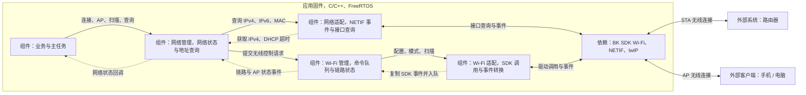
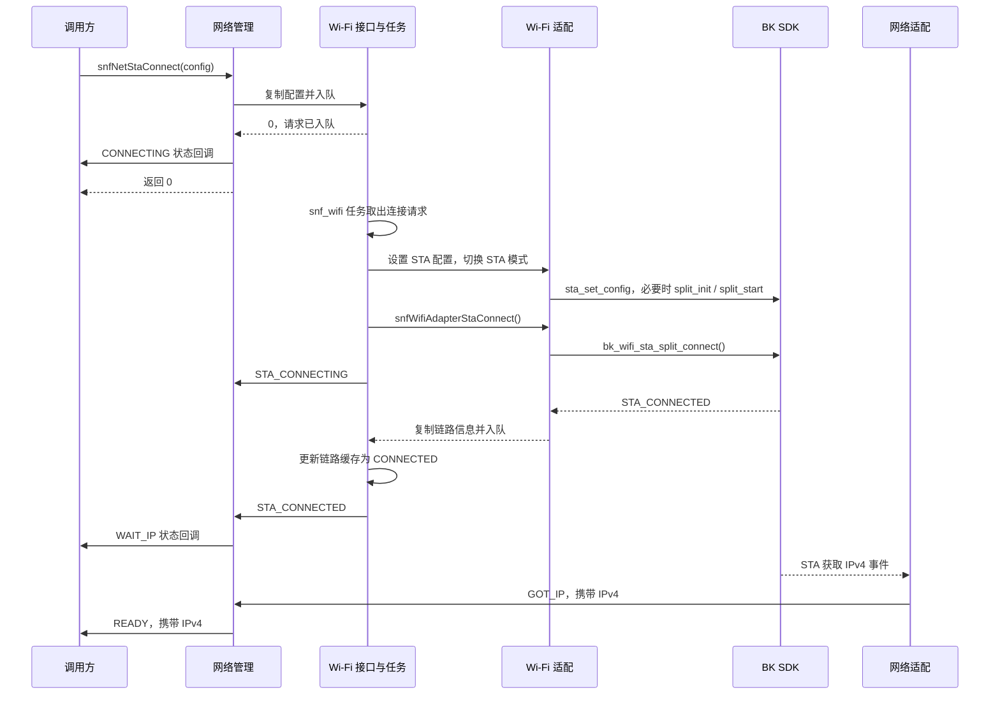

# 网络管理与 Wi-Fi 管理

网络管理向业务提供 STA/AP 控制、网络状态和地址查询；Wi-Fi 管理负责串行执行无线控制请求，并维护链路与扫描状态。**请求被接受、无线链路建立、取得 IP 地址是三个不同阶段。**

本文以当前 BK7239N 固件为基线，说明设备与外部网络的交互、各模块职责，以及连接、扫描和状态变化流程。

## 1. 设备与外部网络交互

系统边界是 Sonoff 设备。设备通过 STA 接入路由器，也可提供 AP 供手机、电脑访问本地服务。

| 外部对象        | 交互                   | 当前能力的含义                                   |
| ----------- | -------------------- | ----------------------------------------- |
| 路由器 / 无线接入点 | STA 关联、认证和 IP 配置     | `READY` 表示收到 STA 获取 IPv4 的事件，不保证互联网或云服务可达 |
| 手机 / 电脑     | 连接设备 AP，访问本地 HTTP 服务 | `AP_READY` 表示 AP 启动调用成功；当前主任务据此启动 HTTP 服务 |
| 调试及串口终端     | 发起连接、AP 和扫描命令        | CLI 目前直接调用 Wi-Fi 管理，与通过网络管理接入的业务路径不同      |

这些能力均由应用固件提供。`snf_main`、`snf_wifi` 是固件内部任务；SDK Wi-Fi、NETIF 和 lwIP 提供底层网络能力。

本模块管理 Wi-Fi STA/AP，不管理 Thread 的入网和 IPv6 生命周期。HTTP 处理业务请求，[NVDM](nvdm.md) 提供配置存储，[OTA](ota.md) 处理升级，均通过各自接口协作。当前网络初始化没有读取 NVDM 中的 Wi-Fi 凭据。

## 2. 组件职责与依赖

实线表示调用或通信，虚线表示事件通知。网络管理汇总链路和 IP 事件，Wi-Fi 管理串行处理无线请求；两者的状态来源和执行上下文不同。

| 组件       | 主要职责                                             | 源码入口                                                                                        |
| -------- | ------------------------------------------------ | ------------------------------------------------------------------------------------------- |
| 网络管理     | 汇总链路/IP 事件、维护网络状态、选择地址查询接口；没有独立任务或状态锁            | [sonoff_net.c](../sonoff/net/sonoff_net.c)、[sonoff_net.h](../sonoff/net/sonoff_net.h)       |
| Wi-Fi 管理 | 深度 10 的队列处理控制请求和 SDK 事件；互斥锁保护主要缓存状态              | [sonoff_wifi.c](../sonoff/wifi/sonoff_wifi.c)、[sonoff_wifi.h](../sonoff/wifi/sonoff_wifi.h) |
| 网络适配     | 监听 `EVENT_MOD_NETIF`，查询 STA/AP 的 IPv4、IPv6 和 MAC | [sonoff_net_adapter.c](../sonoff/net/sonoff_net_adapter.c)                                  |
| Wi-Fi 适配 | 校验配置、切换模式、调用 SDK、转换无线事件与错误码                      | [sonoff_wifi_adapter.c](../sonoff/wifi/sonoff_wifi_adapter.c)                               |
| 主任务      | 将 `AP_READY` 转为主任务事件，再启动 HTTP 服务                 | [sonoff_main.c](../sonoff/main/sonoff_main.c)                                               |

## 3. 初始化与接入契约

### 3.1 初始化顺序

正常业务启动时，`sonoffEntry()` 调用 `snfMainInit()`：先建立主任务及队列、注册网络回调，再调用 `snfNetInit()`。网络初始化依次完成 NETIF 适配、Wi-Fi 队列/互斥锁/适配器/任务以及两层事件回调的注册。

**初始化只建立管理能力，不自动连接路由器或启动 AP。** 主任务中的 `snfNetTestInit()` 当前也只准备测试模块资源，不发起网络连接。实际连接参数由调用方传入。

`snfNetInit()` 会占用 Wi-Fi 管理的单个回调槽。已通过网络管理接入的业务应使用 `snfNet*` 控制接口，避免绕过网络状态维护。

### 3.2 公共接口

配置和结果结构定义在 [sonoff_wifi_type.h](../sonoff/wifi/sonoff_wifi_type.h)。

| 用途          | 接口                                                       | 语义                                                                |
| ----------- | -------------------------------------------------------- | ----------------------------------------------------------------- |
| STA 连接 / 断开 | `snfNetStaConnect()` / `snfNetStaDisconnect()`           | 请求入队后，网络层立即进入 `CONNECTING` / `IDLE`                               |
| AP 启动 / 停止  | `snfNetApStart()` / `snfNetApStop()`                     | 请求入队后，网络层立即进入 `AP_STARTING` / `IDLE`                              |
| 网络状态        | `snfNetGetState()` / `snfNetRegisterEventCallback()`     | 同步查询或接收状态变化；相同状态不重复通知                                             |
| 地址查询        | `snfNetGetIpv4()` / `snfNetGetIpv6()` / `snfNetGetMac()` | `AP_STARTING/AP_READY` 查询 AP，其他状态查询 STA                           |
| 无线状态        | `snfWifiGetMode()` / `snfWifiGetLinkStatus()`            | 分别查询工作模式和 STA 链路状态                                                |
| 连接信息        | `snfWifiStaGetLinkInfo()` / `snfWifiStaGetRssi()`        | 前者返回连接事件缓存，后者查询当前 RSSI                                            |
| 扫描          | `snfNetScan()` / `snfWifiScan()`                         | 提交扫描请求；通过 `snfWifiScanStatus()`、`snfWifiScanGetResults()` 查询状态和结果 |

控制接口返回 `0` 表示请求已入队；负数表示请求未接受，队列满时不等待并返回 `-2`。后续驱动调用可能失败，不能把入队成功当作连接成功。配置按值复制，调用返回后可复用配置结构。

SSID 最长 32 字节、密码最长 64 字节，结构体额外预留字符串结束符。配置内容的详细校验在 Wi-Fi 任务执行时进行。适配层单独使用 `SnfWifiAdapterErr`，其错误值为正数；业务调用应遵循管理层接口的返回值约定。

IPv4 使用网络字节序，IPv6/MAC 输出缓冲分别至少为 16/6 字节。IPv6 查询依赖 `CONFIG_IPV6`，返回接口的第一个有效地址；当前网络状态机由 IPv4 事件驱动。

### 3.3 状态与回调上下文

| 维度         | 当前取值 / 执行方式                                                    | 接入时的判断依据                             |
| ---------- | -------------------------------------------------------------- | ------------------------------------ |
| Wi-Fi 工作模式 | `IDLE / STA / AP`                                              | 适配器具备 `AP_STA` 模式，当前管理接口没有双模式入口      |
| STA 链路     | `IDLE / CONNECTING / CONNECTED / DISCONNECTING / DISCONNECTED` | `CONNECTED` 只表示无线链路建立；主动断开后模式仍可为 STA |
| 扫描状态       | `0` 非扫描中、`1` 扫描中                                               | 请求刚入队时仍可能读到 `0`，不能用它单独判断扫描已完成        |
| Wi-Fi 外部回调 | `snf_wifi` 任务中执行                                               | 事件载荷应在回调内消费或复制                       |
| 网络状态回调     | 调用方任务、Wi-Fi 任务或 SDK NETIF 回调                                   | 没有统一线程；不应在回调里执行耗时业务或假设操作完全串行         |

网络回调再次注册会覆盖原回调；Wi-Fi 回调重复注册会失败。需要多个业务订阅者时，应在已有回调中分发。`READY` 的 IPv4 数据应在回调内复制，不应长期持有其指针。

## 4. STA 连接流程

### 4.1 典型成功时序

图示为典型顺序。Wi-Fi 事件经过队列，IP 事件直接进入网络管理，因此实际处理顺序可能交错：`CONNECTING` 收到获取 IP 事件可直接进入 `READY`，随后处理的 `STA_CONNECTED` 不会把 `READY` 改回 `WAIT_IP`。调用方应以实际回调和当前状态为准。

### 4.2 主要网络状态转换

下图省略 `SNF_NET_STATE_` 前缀，展示主要使用路径；模式切换、重复请求和迟到事件的过滤以 `sonoff_net.c` 为准。

`RECONNECT_WAIT` 记录连接中断，Sonoff 层尚未实现重连定时器、退避和最大重试次数。网络适配当前仅将 STA 的 DHCP 超时映射为 `LOST_IP`，网络管理只在 `WAIT_IP/READY` 接受它；`RECONNECT_WAIT` 中直接到达的 `GOT_IP` 会被忽略。

主动断开或停止 AP 时，`IDLE` 表示管理层已接受停止意图，驱动操作稍后执行。AP 停止通过切换到 `NONE` 关闭已启动的 STA/AP；STA 断开只发起断连，保留 STA 模式。

## 5. AP、HTTP 与扫描

### 5.1 AP 启动到 HTTP 服务

1. 业务通过 `snfNetApStart()` 提交 SSID、密码、信道、最大连接数和安全类型。
2. Wi-Fi 任务配置 AP，再调用 SDK 启动。当前 AP 的 IP、网关、DNS 固定为 `192.168.100.1`，掩码为 `255.255.255.0`。
3. 配置和模式切换成功后，Wi-Fi 管理主动发出 `AP_STARTED`；网络管理进入 `AP_READY`，主任务启动 80 端口 HTTP 服务。

开放热点要求密码为空，其他安全类型要求密码长度为 8～64 字节，具体支持范围还受 SDK 限制。`AP_READY` 不等待 SDK 的 AP 启动事件；AP IP 配置调用的返回值当前未检查。SDK AP 启停及客户端加入/离开事件虽已在适配器转换，Wi-Fi 管理尚未转发。

当前没有停止 AP 后同步关闭 HTTP 服务的业务联动。网页、CGI 和上传处理属于 HTTP/OTA 模块，不属于网络状态机。

### 5.2 扫描与结果读取

1. 请求入队后，Wi-Fi 任务调用 `bk_wifi_scan_start(NULL)`；调用成功才将扫描状态置为 `1`。
2. SDK 扫描完成事件进入 Wi-Fi 队列；任务清除扫描状态并发出 `SCAN_DONE`。
3. `snfWifiScanGetResults()` 获取 SDK 结果，按调用者容量复制 SSID、BSSID、RSSI、信道和安全类型，通过 `result_count` 输出条数，随后释放 SDK 结果缓冲。

网络管理的 `snfNetScan()` 只转发请求，不向网络状态回调转发 `SCAN_DONE`。当前业务不能通过另行注册 Wi-Fi 回调获取结果通知，因为该单槽回调已由网络管理占用；需要在现有分发链路中扩展。

## 6. 当前边界与接手重点

| 边界         | 代码行为及影响                                                                                                         |
| ---------- | --------------------------------------------------------------------------------------------------------------- |
| 控制失败通知不完整  | `STA_CONNECT_FAILED`、`AP_START_FAILED`、`AP_STOPPED`、`SCAN_FAILED` 虽有声明，Wi-Fi 管理当前未发出；配置/切换失败主要记录日志，网络状态可能停留在进行中 |
| STA 立即连接失败 | 链路缓存会变为 `DISCONNECTED`，但仍发出 `STA_CONNECTING`；不能把该事件当作驱动成功确认                                                     |
| SDK 事件丢失   | Wi-Fi 队列满时不等待，事件入队失败没有重试；并非每个请求都有完成通知                                                                           |
| 两层状态可能不一致  | CLI 的 `sonoff wifi` 直接调用 `snfWifi*`；网络状态为 `IDLE` 时会过滤 STA 连接/IP 事件，底层可能已连接但网络仍显示空闲                              |
| 并发模式切换     | 网络状态没有统一队列或锁；接入方应协调连接、断开和模式切换的发起者                                                                               |
| 凭据持久化未接入   | NVDM 有 Wi-Fi 配置项，网络/Wi-Fi 管理尚未自动读取或保存它们                                                                         |

接手时先从 `sonoff_main.c → sonoff_net.c → sonoff_wifi.c` 理解控制和状态通知，再看两个适配器的 SDK 映射。验证连接行为时同时观察网络态、无线链路态及 IP 查询结果。