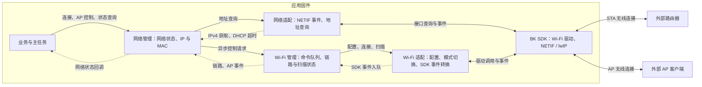
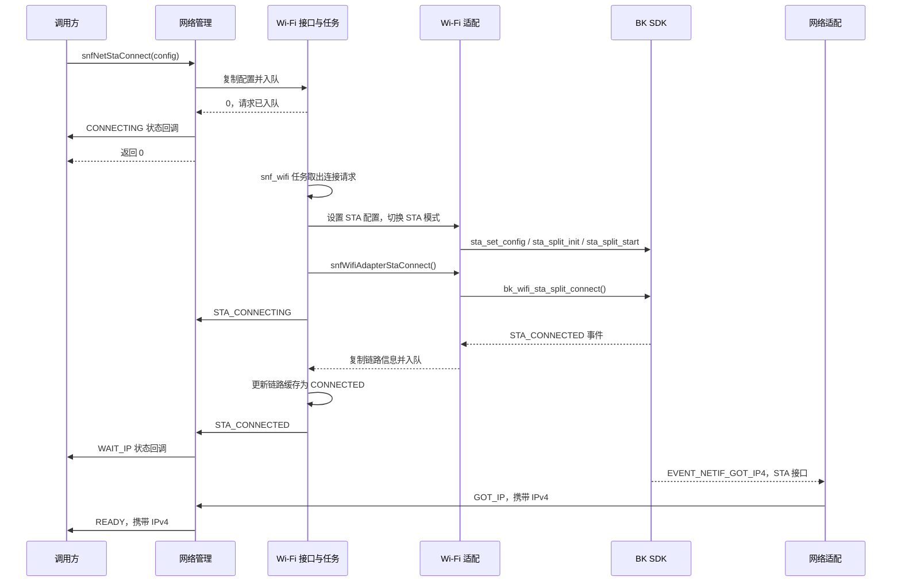
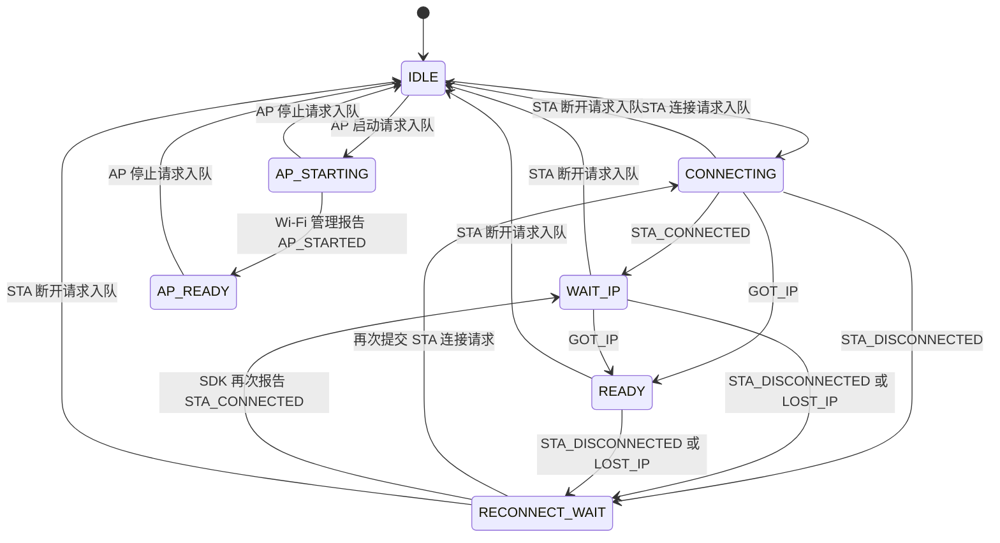

# 网络管理与 Wi-Fi 管理说明

**Wi-Fi 管理负责扫描、STA 连接和 AP 控制；网络管理结合 Wi-Fi 链路与 IP 事件，向业务提供网络状态和地址查询。控制请求通过队列异步执行，接口返回成功只表示请求已入队。**

## 1. 使用场景与模块边界

| 场景       | 外部交互                      | 业务判断依据                                         |
| -------- | ------------------------- | ---------------------------------------------- |
| STA 接入   | 设备连接路由器，SDK 处理无线连接和 IP 配置 | `READY` 表示收到 STA 获取 IPv4 的事件，不代表互联网或云服务可达      |
| AP 服务    | 设备提供热点，手机等客户端接入           | `AP_READY` 表示管理层确认 AP 启动调用成功；当前主任务据此启动 HTTP 服务 |
| Wi-Fi 扫描 | 设备发现周围热点                  | 扫描完成后读取 SSID、BSSID、RSSI、信道和安全类型                |

这两个模块当前管理 Wi-Fi 的 STA/AP 接口；Thread 网络、HTTP 业务协议和配网凭据持久化由各自模块负责。管理层提供 `IDLE / STA / AP` 三种模式，适配层虽有 `AP_STA` 枚举和实现，当前管理接口未提供双模式入口。

## 2. 模块划分与运行关系

按 C4 展开应用固件中的组件关系：网络管理、Wi-Fi 管理、适配器及 SDK 均位于同一固件内。`snf_wifi` 是固件内部的 FreeRTOS 任务。

| 组件       | 职责与源码                                                                                                       |
| -------- | ----------------------------------------------------------------------------------------------------------- |
| 网络管理     | [sonoff_net.c](../sonoff/net/sonoff_net.c)：汇总链路/IP 事件、维护网络状态、选择当前查询接口；没有独立任务或状态锁                            |
| Wi-Fi 管理 | [sonoff_wifi.c](../sonoff/wifi/sonoff_wifi.c)：通过深度 **10** 的队列串行处理控制请求和 SDK Wi-Fi 事件，用互斥锁保护主要缓存状态            |
| 网络适配     | [sonoff_net_adapter.c](../sonoff/net/sonoff_net_adapter.c)：监听 `EVENT_MOD_NETIF`，查询 STA/AP 的 IPv4、IPv6 和 MAC |
| Wi-Fi 适配 | [sonoff_wifi_adapter.c](../sonoff/wifi/sonoff_wifi_adapter.c)：转换配置与错误码，调用 SDK，转换连接、断开、扫描及 AP 事件             |
| 业务接入     | [sonoff_main.c](../sonoff/main/sonoff_main.c)：注册网络回调，将 `AP_READY` 转为主任务事件，再启动 HTTP 服务                       |

初始化入口为 `snfMainInit()`：先注册网络回调，再调用 `snfNetInit()`。网络初始化依次准备网络适配器、Wi-Fi 管理队列/互斥锁/任务及事件回调，最后标记初始化完成。**初始化本身不连接路由器、不启动 AP，也不读取 NVDM 中的 Wi-Fi 参数。**

## 3. 接口与状态约定

公共接口见 [sonoff_net.h](../sonoff/net/sonoff_net.h)、[sonoff_wifi.h](../sonoff/wifi/sonoff_wifi.h)，参数结构见 [sonoff_wifi_type.h](../sonoff/wifi/sonoff_wifi_type.h)。已接入网络管理的业务应通过 `snfNet*` 发起连接和 AP 控制。

| 用途        | 接口                                                       | 行为                                                                |
| --------- | -------------------------------------------------------- | ----------------------------------------------------------------- |
| STA 连接/断开 | `snfNetStaConnect()` / `snfNetStaDisconnect()`           | 入队成功后，网络状态立即改为 `CONNECTING` / `IDLE`                              |
| AP 启动/停止  | `snfNetApStart()` / `snfNetApStop()`                     | 入队成功后，网络状态立即改为 `AP_STARTING` / `IDLE`                             |
| 网络状态      | `snfNetGetState()` / `snfNetRegisterEventCallback()`     | 同步查询或接收状态变化；相同状态不重复通知                                             |
| 地址查询      | `snfNetGetIpv4()` / `snfNetGetIpv6()` / `snfNetGetMac()` | AP 启动中或就绪时查询 AP 接口，其余状态查询 STA 接口                                  |
| Wi-Fi 状态  | `snfWifiGetMode()` / `snfWifiGetLinkStatus()`            | 分别查询工作模式和 STA 链路状态                                                |
| 连接信息      | `snfWifiStaGetLinkInfo()` / `snfWifiStaGetRssi()`        | 前者读取连接时缓存的信息，后者向 SDK 查询当前 RSSI                                    |
| 扫描        | `snfNetScan()` / `snfWifiScan()`                         | 异步请求扫描；通过 `snfWifiScanStatus()`、`snfWifiScanGetResults()` 查询状态与结果 |

控制接口返回 `0` 表示入队成功，负数表示请求失败；队列满时不等待，返回 `-2`。SSID、密码等配置随请求按值复制，调用后无需继续保留原结构体。SSID 最长 32 字节、密码最长 64 字节，均需以 `\0` 结束；具体配置校验在 Wi-Fi 任务执行时进行。Wi-Fi 适配层单独使用 `SnfWifiAdapterErr`，其中非零错误码为正数。

Wi-Fi 内部维护三组独立状态，不能仅用其中一项判断网络可用：

| 状态维度   | 取值与含义                                                                                |
| ------ | ------------------------------------------------------------------------------------ |
| 工作模式   | `IDLE / STA / AP`；STA 主动断开后模式仍可为 `STA`                                               |
| STA 链路 | `IDLE / CONNECTING / CONNECTED / DISCONNECTING / DISCONNECTED`；`CONNECTED` 只代表无线链路建立 |
| 扫描状态   | `0` 未扫描、`1` 扫描中；不表示网络连接状态                                                            |

IPv4 使用网络字节序，IPv6/MAC 输出缓冲分别需 16/6 字节。IPv6 查询依赖 `CONFIG_IPV6`，返回接口中第一个有效地址；当前网络状态机由 IPv4 事件驱动，没有独立的 IPv6 就绪状态。

## 4. STA 连接与网络状态

### 4.1 UML 时序：连接成功路径

图示为典型成功顺序；STA 尚未启动时才执行 `split_init / split_start`。Wi-Fi 事件经过队列，IP 事件直接进入网络管理，因此实际顺序可能交错：`CONNECTING` 收到有效的获取 IP 事件也可直接进入 `READY`，随后到达的 `STA_CONNECTED` 不会将 `READY` 改回 `WAIT_IP`。

### 4.2 UML 状态：主要转换路径

下图省略枚举前缀 `SNF_NET_STATE_`，展示通过网络接口发起控制时的主要路径。

`RECONNECT_WAIT` 只记录连接中断，**当前 Sonoff 层没有配套的重连定时器、退避或最大重试次数**；是否由 SDK 自行恢复取决于 SDK 行为。网络适配器目前仅将 STA 的 `EVENT_NETIF_DHCP_TIMEOUT` 映射为 `LOST_IP`，且网络管理只在 `WAIT_IP/READY` 接受该事件。

主动断开或停止 AP 时，网络层在请求入队后即进入 `IDLE`，底层操作稍后执行，不能据此认定无线接口已经停止。停止 AP 的底层动作是切换到 `NONE`，关闭已启动的 STA/AP；STA 断开则保留 STA 模式。

## 5. AP 与扫描流程

### 5.1 AP 启动与业务接入

1. `snfNetApStart()` 提交 AP 配置；Wi-Fi 任务调用适配器设置 SSID、密码、信道、最大连接数和安全类型。
2. 适配器配置 AP 地址并调用 SDK 启动 AP。当前固定 IP/网关/DNS 为 `192.168.100.1`，掩码为 `255.255.255.0`；开放热点要求密码为空，其他安全类型要求密码长度为 8～64 字节。
3. 配置及模式切换返回成功后，Wi-Fi 管理直接发出 `AP_STARTED`，网络管理进入 `AP_READY`。主任务接到对应事件后执行 `snfHttpServerStart()`。

这里的 `AP_STARTED` 由管理任务主动发出，没有等待 SDK 的 AP 启动事件；AP IP 配置调用的返回值当前也未检查。SDK 的 AP 启停、客户端加入/离开事件虽已由适配器转换，Wi-Fi 管理尚未继续转发。主任务当前也未接入停止 AP 后关闭 HTTP 服务的联动。

### 5.2 扫描与结果读取

1. 扫描请求入队后，由 Wi-Fi 任务调用 `bk_wifi_scan_start(NULL)`；启动成功才将扫描状态置为 `1`。
2. SDK 报告扫描完成，适配器将事件送入 Wi-Fi 队列；任务将扫描状态清为 `0`，发出 `SCAN_DONE`。
3. `snfWifiScanGetResults()` 从 SDK 取结果，按调用者容量复制到 `SnfWifiLinkInfo` 数组，返回实际条数，随后释放 SDK 结果缓冲。

**刚提交扫描时读取到状态** `0`**，也可能是任务尚未执行请求。** 网络管理的 `snfNetScan()` 只转发启动请求，网络状态回调不转发 `SCAN_DONE`，因此当前集成下尚无面向业务的网络层扫描完成通知。

## 6. 当前实现边界

- **回调是单槽接口。** `snfNetInit()` 占用 Wi-Fi 回调，重复注册 Wi-Fi 回调会失败；网络回调再次注册会覆盖原回调，包括主任务的 AP/HTTP 联动。需要多个订阅者时应在已有回调中分发。
- **网络回调执行上下文不固定。** API 引起的状态变化发生在调用者任务；Wi-Fi 事件发生在 `snf_wifi` 任务；IP 事件发生在 SDK NETIF 回调中。网络状态没有统一队列或锁，业务应避免并发切换连接模式，回调中宜只复制数据和投递业务事件。`READY` 携带的 IPv4 指针仅保证回调期间有效。
- **失败通知尚不完整。** `STA_CONNECT_FAILED`、`AP_START_FAILED`、`AP_STOPPED`、`SCAN_FAILED` 虽已声明，当前 Wi-Fi 管理未发出这些事件。配置/模式切换失败主要记录日志；STA 连接调用立即失败时仍会发出 `STA_CONNECTING`。SDK Wi-Fi 事件入队失败也没有重试，不能假设每个请求必有完成回调。
- **直接调用 Wi-Fi 控制接口可能使两层状态不同步。** 当前 `sonoff wifi` 调试命令直接调用 `snfWifi`*；例如网络处于 `IDLE` 时会忽略 STA 连接及获取 IP 事件，底层可能已连接而网络仍为 `IDLE`。
- **配置与详细故障信息没有完整上送。** 这两个管理模块只保存运行时配置，未接入 [NVDM](nvdm.md) 的 Wi-Fi 参数读写；适配器解析的 STA 断开原因在 Wi-Fi 管理对外通知时未继续传递。

本篇以 C4 的固件边界和组件职责组织架构，以 UML 时序与状态图补充异步执行细节；图示和接口语义以当前实现为准。