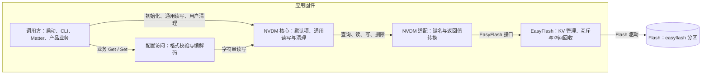
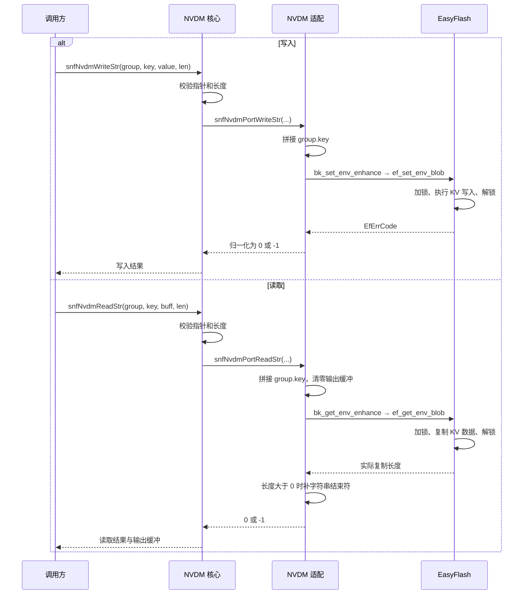
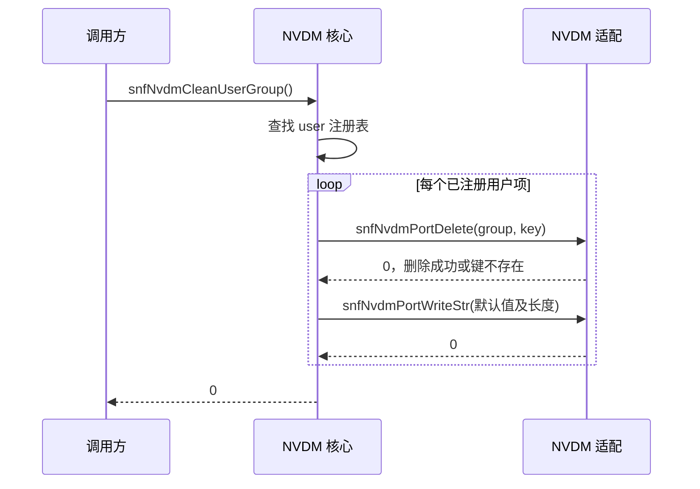

# NVDM 数据存储与读取说明

适用：`onoff_plug / BK7239N`。依据：2026-09-09 工作区源码；未进行本次构建或板端验证。

**NVDM 为用户配置、工厂信息和 Matter 生产数据提供统一的持久化读写接口。数据按 `group.key` 存入 EasyFlash，调用同步完成；启动时补齐缺失项，主动清理时恢复指定配置的默认值。**

## 1. 使用场景与数据组织

产测上位机通过 CLI/AT 写入生产数据；启动流程初始化配置、读取 MAC 和 License；Matter 通过定制的 `FactoryDataProvider` 获取配网参数及凭据；产品代码通过私有接口访问自己的配置项。

| 逻辑分组 | 主要内容 | 默认值特点 |
| --- | --- | --- |
| `user` | Wi-Fi 参数、产品私有项，如 `test.item1` | 注册表提供产品初始值 |
| `factory` | 序列号、授权码、设备 ID、API Key、型号、UIID、BASE MAC | 多数为空，需生产写入 |
| `matter` | 配网参数、厂商/产品信息、CD、DAC 证书与私钥、PAI 证书 | 多数为空或占位值，默认项存在不代表已具备配网条件 |

三个组共用 `easyflash` 分区，仅通过键名前缀区分。例如：`group="user"`、`key="test.item1"` 对应实际键 `user.test.item1`。NVDM 的 `matter` 组与 Flash 中独立的 `matter` 分区是不同的存储范围。

存储格式统一按字符串使用：整数转为十进制文本，Matter 部分 ID 使用十六进制文本，证书和私钥使用 Base64，业务读取时再解析或解码。Base64 不提供存储加密；证书导入时的 ECDH/AES-GCM 处理属于传输接入流程。

当前 [分区配置](../build_tool/config/bk7239n/partitions.csv) 为 EasyFlash 预留 **16 KiB**，但 SDK [ef_cfg.h](../bk_openthread/bk_idk/components/easy_flash/easy_flash_V4.X/inc/ef_cfg.h) 的 `ENV_AREA_SIZE` 为 **8 KiB**，其中还需容纳元数据和垃圾回收空间。存储起始地址由 SDK 查询 `BK_PARTITION_EASYFLASH` 获取。

## 2. 模块划分与职责

NVDM 及 EasyFlash 均运行在应用固件内，Flash 是持久化数据存储。下图展开固件中的组件关系。

| 组件 | 职责与源码 |
| --- | --- |
| 配置访问 | [sonoff_nvdm_config.c](../sonoff/nvdm/sonoff_nvdm_config.c) 处理工厂/Matter 字段、License 和证书；[产品私有项](../project/onoff_plug/src/sonoff_private_item.c) 封装产品配置 |
| NVDM 核心 | [sonoff_nvdm.c](../sonoff/nvdm/sonoff_nvdm.c) 维护注册表、默认值、通用读写和用户组清理 |
| NVDM 适配 | [sonoff_nvdm_port.c](../sonoff/nvdm/sonoff_nvdm_port.c) 拼接 `group.key`，处理字符串结束符并转换错误码 |
| EasyFlash | [bk_ef.c](../bk_openthread/bk_idk/components/easy_flash/bk_ef.c) 对接 V4 Blob 接口；[ef_port.c](../bk_openthread/bk_idk/components/easy_flash/easy_flash_V4.X/port/ef_port.c) 提供 Flash 操作和锁 |

NVDM 没有独立任务、事件队列或异步回调，也不维护一份完整的 RAM 配置副本。读写在调用者任务中执行，底层 EasyFlash 对单次 KV 操作加锁。

## 3. 初始化与默认值

1. SDK 驱动初始化阶段调用 `easyflash_init()`，准备底层存储和锁。
2. `sonoffEntry()` 调用 `snfNvdmInit()`，遍历三个组的静态注册表。
3. 对每个键查询是否存在；存在则保留，查询返回非 0 时尝试写入默认值。任一写入失败即返回 `-1`。

注册表由 `SnfNvdmItem` 和 `SnfNvdmItemTable` 描述，保存组名、键名、默认字符串及长度。它用于默认值初始化、通用 CLI 校验和用户项清理。

**初始化不检查已有值的业务合法性，也不覆盖已有空字符串。** 修改固件中的默认值不会自动更新已存数据；新增注册项会在下次初始化时补齐。存在性接口将“不存在”和“查询失败”都返回为负数，因此底层 EasyFlash 必须先初始化成功。

## 4. 读写流程与接口约束

### 4.1 通用接口

公共声明见 [sonoff_nvdm.h](../sonoff/nvdm/sonoff_nvdm.h)。

| 接口 | 行为与返回值 |
| --- | --- |
| `snfNvdmReadStr(group, key, buff, len)` | 同步读取，`len` 是缓冲区容量；返回 `0/-1`，不返回实际长度 |
| `snfNvdmWriteStr(group, key, value, len)` | 同步写入传入的 `len` 字节；字符串调用按 `strlen(value)+1` 传参；无需额外 Save |
| `snfNvdmReadInt(group, key)` | 读字符串后调用 `atoi()`，直接返回整数或读取错误码 |
| `snfNvdmWriteInt(group, key, value)` | 将整数格式化为十进制字符串后写入，返回 `0/-1` |
| `snfNvdmCleanUserGroup()` | 逐项删除并写回用户注册项的默认值，返回 `0/-1` |

写入接口不自动追加字符串结束符；调用者应提供包含结束符的有效数据。合成键名长度当前最多 **32 字节**，包含组名和中间的点号。

### 4.2 UML 时序：写入与读取

以下展示通用字符串接口的正常路径。格式、范围和证书解码等业务处理由上层配置访问接口负责。

读取缓冲区不足时，当前实现截断数据并在末尾补 `\0`，仍可能返回成功。调用者需按配置项最大长度分配缓冲区，不能用返回 `0` 判断内容完整。通用接口按字符串处理；Matter 二进制凭据应通过专用 Get 接口读取，映射见 [Matter 生产数据说明](../sonoff/nvdm/matter_factory_data.md)。

## 5. 清理范围与产品扩展

### 5.1 UML 时序：恢复用户默认值

图示为成功路径。任一删除或写入失败立即返回 `-1`，已完成的项保留修改。它只遍历注册的 `user` 项，保留 `factory`、`matter` 组，也不会扫描删除未注册的 `user.*` 键。

| 操作 | 影响范围 |
| --- | --- |
| `snfNvdmCleanUserGroup()` | 注册的用户项，包括产品扩展项，恢复默认值 |
| `snfLicenseClear()` | 清空 License 的五个字段，保留序列号和授权码 |
| `snfMatterCdClear()` / `snfMatterSecureCertClear()` | 分别清空 CD，或 DAC 证书、DAC 私钥和 PAI 证书 |
| Matter 恢复出厂 | 当前实现擦除独立的 `matter`、`ot_setting` 分区并重启，未清理 NVDM 所在的 `easyflash` 分区 |

产品新增配置时，在 [sonoff_private_item.h](../project/onoff_plug/inc/sonoff_private_item.h) 的 `SNF_PRIVATE_NVDM_USER_ITEM` 中用 `NVDM_USER_ITEM` 注册键名和默认值，再在产品源文件中提供 Get/Set 及必要的格式校验。现有 `test.item1` 可作为接入位置参考。

## 6. 当前实现边界

- **注册表不是通用读写白名单。** 通用 `ReadStr/WriteStr` 可访问未注册键；CLI 的 `read/write` 只允许注册项，但直接使用通用接口，不执行专用业务校验。
- **整数读取不能明确区分数值与错误。** `ReadInt()` 使用 `atoi()`，非法文本可能得到 `0`，负数值可能与错误码重叠；需严格校验时使用带输出参数的专用业务接口。
- **多项操作没有事务保证。** License、证书写入和用户清理都是多次 KV 操作。部分业务包含读回校验或失败清空，但没有跨项事务锁和统一回滚；不能据单次 KV 加锁推断批量更新原子性。
- **通用调试命令不适合确认长数据或隐私数据。** `show/read` 使用 512 字节缓冲并输出原文；长凭据可能截断。CLI `read/write` 的外层 `ret=0` 也不代表存储成功，具体失败由内部日志给出。

本篇按 C4 的边界与组件关系组织架构说明，UML 时序图补充同步读写和清理行为；底层存储可靠性与断电恢复效果需结合板端测试确认。
