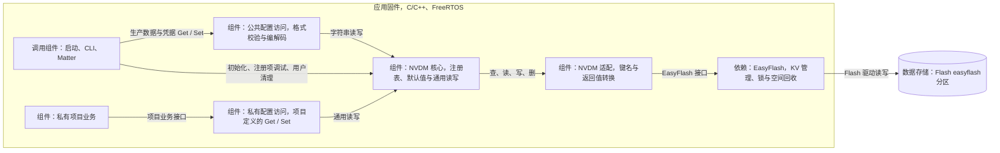
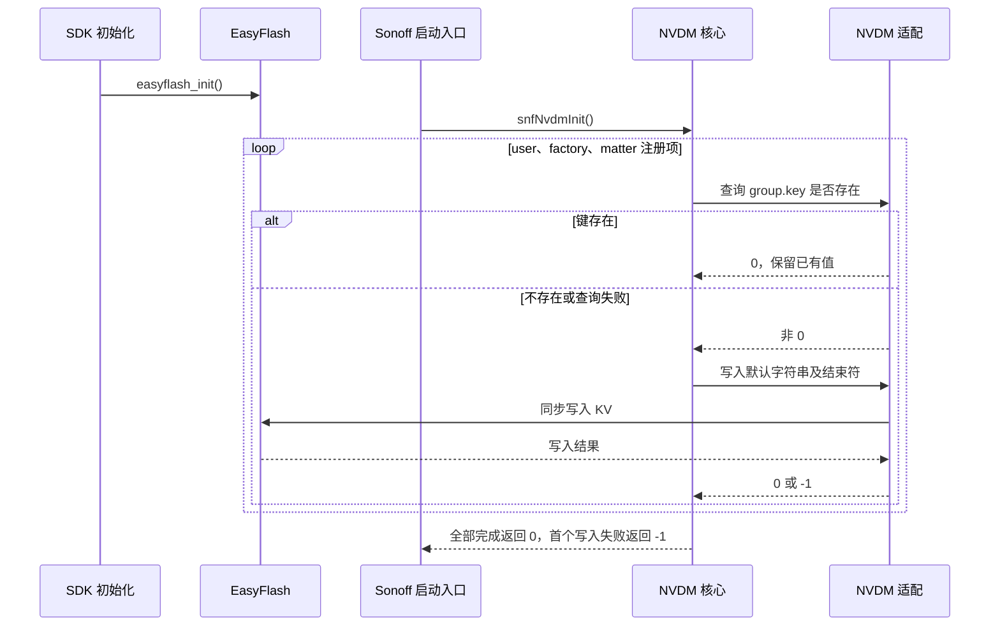
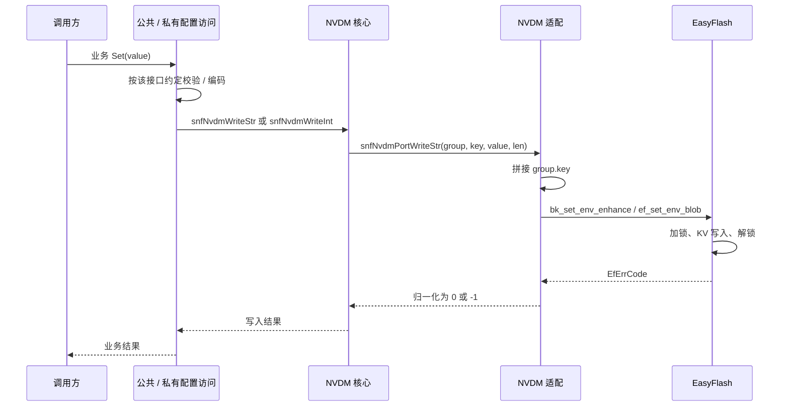
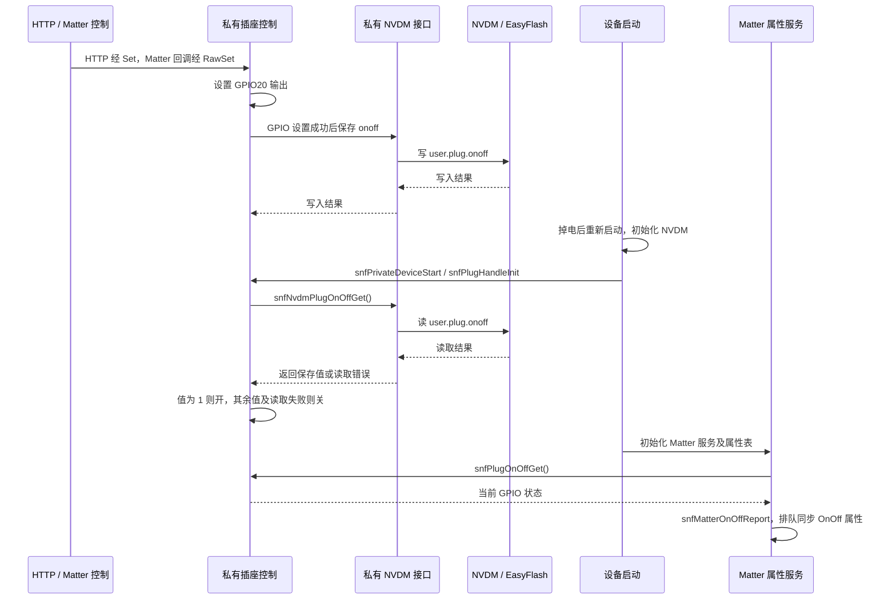

# NVDM 配置持久化

NVDM 为用户配置、工厂信息和 Matter 生产数据提供统一的持久化接口。数据按 `group.key` 存入 EasyFlash，读写同步完成；启动时补齐缺失项，用户清理时恢复已注册用户项的默认值。

**公共层负责存储机制与公共配置，私有项目定义自己的配置项和业务访问接口。** 当前 `project/onoff_plug/` 用插座掉电保持演示私有 NVDM 的接入。

## 1. 配置访问与存储边界

系统边界是 Sonoff 设备。产测上位机通过 CLI/AT 写入生产数据；设备启动时读取配置、MAC 和 License；Matter 通过项目定制的 `FactoryDataProvider` 获取配网参数与凭据；私有项目读写自身业务配置。

配置访问、NVDM 和 EasyFlash 均运行于应用固件中，持久化数据存储位于片上 Flash。NVDM 没有独立任务、队列或异步回调，也不维护完整的 RAM 配置副本。

| 存储范围                      | 内容                                            | 所属机制              |
| ------------------------- | --------------------------------------------- | ----------------- |
| `easyflash` 分区中的 `user.*` | Wi-Fi 参数、私有项目配置，如 `user.plug.onoff`           | NVDM 用户组          |
| 同分区中的 `factory.*`         | 序列号、授权码、设备 ID、API Key、BASE MAC、型号、UIID 及私有工厂项 | NVDM 工厂组          |
| 同分区中的 `matter.*`          | 配网参数、厂商/产品信息、CD、DAC 证书及私钥、PAI 证书              | NVDM Matter 生产数据组 |
| 独立的 `matter` 分区           | Matter 运行时持久化数据，包括 Fabric 和配置为持久化的属性          | Matter 平台存储       |
| 独立的 `ot_setting` 分区       | Thread 网络持久化数据                                | OpenThread 平台存储   |

三个 NVDM 组共享一个 EasyFlash 存储区，通过键名前缀区分，不是三个物理分区。`group="user"`、`key="plug.onoff"` 合成为 `user.plug.onoff`。**NVDM 的** `matter` **组与独立的** `matter` **分区用途不同，清理范围也不同。**

当前 [分区配置](../build_tool/config/bk7239n/normal/auto_partitions.csv) 为 EasyFlash 预留 **16 KiB**；构建应用 [项目覆盖配置 ef_cfg.h](../sonoff_modify/idk_modify/components/easy_flash/easy_flash_V4.X/inc/ef_cfg.h) 后，`ENV_AREA_SIZE` 同为 **16 KiB**。SDK 原文件仍可能显示 8 KiB，应以覆盖后的构建配置为准。可用载荷小于分区容量，需要留出元数据和垃圾回收空间；起始地址由 SDK 查询 `BK_PARTITION_EASYFLASH` 获取。

## 2. 组件职责与依赖

| 组件        | 职责与源码入口                                                                                                                                                                                |
| --------- | -------------------------------------------------------------------------------------------------------------------------------------------------------------------------------------- |
| 公共配置访问    | [sonoff_nvdm_config.c](../sonoff/nvdm/sonoff_nvdm_config.c) 处理工厂/Matter 字段、License、证书及业务校验                                                                                             |
| 私有配置访问    | [sonoff_private_item.h](../project/onoff_plug/inc/sonoff_private_item.h)、[sonoff_private_item.c](../project/onoff_plug/src/sonoff_private_item.c) 定义项目的 item、默认值和 Get/Set              |
| NVDM 核心   | [sonoff_nvdm.c](../sonoff/nvdm/sonoff_nvdm.c)、[sonoff_nvdm.h](../sonoff/nvdm/sonoff_nvdm.h) 提供注册表管理、默认值初始化、读写及清理                                                                       |
| NVDM 适配   | [sonoff_nvdm_port.c](../sonoff/nvdm/sonoff_nvdm_port.c) 拼接键名、处理结束符并转换错误码                                                                                                               |
| EasyFlash | [bk_ef.c](../bk_openthread/bk_idk/components/easy_flash/bk_ef.c) 对接 V4 Blob 接口；[ef_port.c](../bk_openthread/bk_idk/components/easy_flash/easy_flash_V4.X/port/ef_port.c) 提供 Flash 操作和锁 |

存储操作在调用者任务中执行，EasyFlash 对单次 KV 操作加锁。多项业务更新仍是多次独立操作，不具备跨项事务保证。

## 3. 数据格式与接口契约

### 3.1 格式约定

NVDM 的通用接口按字符串使用：整数转为十进制文本，Matter 部分 ID 使用十六进制文本，证书与私钥使用 Base64；业务接口负责解析和解码。Base64 不提供存储加密，证书导入中的 ECDH/AES-GCM 属于传输接入流程。

工厂和 Matter 生产数据多数默认项为空或占位值。**配置项存在不代表内容有效，也不代表设备已具备授权或 Matter 配网条件。** 凭据字段映射见 [Matter 生产数据说明](../docs/matter_factory_data.md)

### 3.2 公共接口

| 接口                                        | 行为与返回值                                       |
| ----------------------------------------- | -------------------------------------------- |
| `snfNvdmInit()`                           | 检查注册项并补写缺失项默认值；返回 `0/-1`                     |
| `snfNvdmReadStr(group, key, buff, len)`   | `len` 是缓冲容量；返回 `0/-1`，不返回实际长度                |
| `snfNvdmWriteStr(group, key, value, len)` | 同步写入指定字节；字符串按 `strlen(value)+1` 传参；无需额外 Save |
| `snfNvdmReadInt(group, key)`              | 字符串读取后调用 `atoi()`，直接返回整数或读取错误码               |
| `snfNvdmWriteInt(group, key, value)`      | 格式化为十进制字符串后写入；返回 `0/-1`                      |
| `snfNvdmCleanUserGroup()`                 | 逐项删除并恢复已注册用户项默认值；返回 `0/-1`                   |

合成键名最多 **32 字节**，包含组名和中间的点号。写入接口不自动追加结束符；读取缓冲不足时，当前实现截断数据、补 `\0`，仍可能返回成功，因此返回 `0` 不能证明内容完整。

`ReadInt()` 不能明确区分所有数值与错误：非法文本可能被 `atoi()` 解析成 `0`，负数可能与错误码重叠。业务需根据配置项的合法值域处理结果。

## 4. 初始化与同步读写

### 4.1 初始化规则

SDK 先调用 `easyflash_init()` 初始化存储；随后 `sonoffEntry()` 调用 `snfNvdmInit()`，再执行生产数据检查和私有项目启动。

图中的循环在写入失败时提前结束。初始化不检查已有值的业务合法性，也不覆盖已有空字符串。修改默认值不会自动迁移已有数据；新增注册项会在下一次初始化补齐。存在性接口没有区分“键不存在”和“查询失败”。

### 4.2 一次业务写入

读取沿相同分层返回：适配层先清零缓冲，再从 EasyFlash 读取并补结束符，配置访问层按字段约定解码。通用读写只做基本参数检查；并非每个私有 Get/Set 都已实现额外业务校验。

## 5. 私有项目扩展与掉电保持示例

### 5.1 扩展方式

`project/<项目名>/` 下每个子目录是一个私有项目，目前只有演示项目 `onoff_plug`。公共 [私有入口头文件](../sonoff/private/sonoff_private_device.h)和[产测头文件](../sonoff/private/sonoff_private_factory.h)规定每个项目必须实现的接口；具体 NVDM item 无法统一，`sonoff_private_item.h` 由项目自己提供。

构建时将所选项目的 `src/`、`inc/` 接入公共应用组件。公共 NVDM 核心包含这个项目的 `sonoff_private_item.h`，通过以下宏展开私有注册项：

| 项目提供内容                          | 接入方式                                           |
| ------------------------------- | ---------------------------------------------- |
| `SNF_PRIVATE_NVDM_USER_ITEM`    | 用 `NVDM_USER_ITEM(键名, 默认字符串)` 扩展用户注册表          |
| `SNF_PRIVATE_NVDM_FACTORY_ITEM` | 用 `NVDM_FAC_ITEM(键名, 默认字符串)` 扩展工厂注册表；没有条目时定义为空 |
| 项目 Get/Set                      | 在私有源文件中调用通用 NVDM API，承载项目需要的值域校验和格式转换          |

默认值宏使用 `sizeof` 记录长度，应传入字符串字面量。新增项注册后会自动参与初始化、注册项 CLI 和相应用户清理；普通通用读写允许访问未注册键，注册表不是通用访问白名单。

### 5.2 `onoff_plug` 的状态保持时序

该项目注册 `user.plug.onoff`，默认值为字符串 `"0"`。开关控制见 [sonoff_plug_handle.c](../project/onoff_plug/src/sonoff_plug_handle.c)，Matter 回调见 [DeviceCallbacks.cpp](../project/onoff_plug/matter/src/DeviceCallbacks.cpp)。

图示描述正常 GPIO 操作和存储路径。HTTP 的 `snfPlugOnOffSet()` 在设置后提交 Matter 属性更新；Matter 属性变化回调使用 `snfPlugOnOffRawSet()`，避免再次提交上报。启动同步位于 [chipinterface.cpp](../project/onoff_plug/matter/src/chipinterface.cpp) 的 `InitServer()`，在属性表初始化完成后读取当前 GPIO；上报接口返回成功只表示任务已提交。

当前 `RawSet()` 调用保存接口但未检查保存返回值，故“GPIO 控制成功”仍不能保证“持久化成功”。Matter 的 `OnOff/StartUpOnOff` 还使用自身存储；启动时尝试以当时 GPIO 状态更新属性，并非两个存储区的事务同步。

## 6. 清理范围与接手重点

| 操作                                                  | 影响范围                                                                                                                                                     |
| --------------------------------------------------- | -------------------------------------------------------------------------------------------------------------------------------------------------------- |
| `snfNvdmCleanUserGroup()`                           | 只遍历已注册 `user` 项，包括私有扩展项；逐项删除并写回默认值                                                                                                                       |
| `snfLicenseClear()`                                 | 清空 License 的五个字段，保留序列号和授权码                                                                                                                               |
| `snfMatterCdClear()` / `snfMatterSecureCertClear()` | 分别清空 CD，或 DAC 证书、DAC 私钥及 PAI 证书                                                                                                                          |
| Matter 恢复出厂                                         | 当前 [平台实现](../sonoff_modify/matter_modify/connectedhomeip/src/platform/Beken/ConfigurationManagerImpl.cpp) 擦除 `matter`、`ot_setting` 分区并重启，不清理 `easyflash` |

用户清理不扫描未注册的 `user.*` 键，不影响 `factory/matter` 生产数据组；中途失败立即返回，之前完成的项不会回滚。清理 NVDM 也不会主动更新已经运行的 GPIO 或网络，调用方需安排重新应用配置。

接手时还需注意：

- 公共配置校验只由专用业务接口执行；CLI 的通用 `read/write` 校验注册项后直接访问存储，不经过这些业务校验。
- 多字段 License、证书更新和用户清理没有跨项事务。部分接口有读回验证或失败清空，不能据单次 KV 加锁推断整组更新原子性。
- 通用 `show/read` 用 512 字节缓冲并输出原文，长凭据可能截断；CLI 外层 `ret=0` 不代表底层存储成功，应结合内部结果日志判断。
- 默认值、存储布局和调用链可由代码确认；掉电时的 Flash 行为及整条恢复链路需要板端验证。

