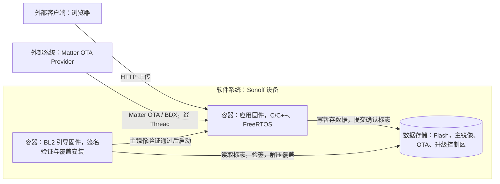
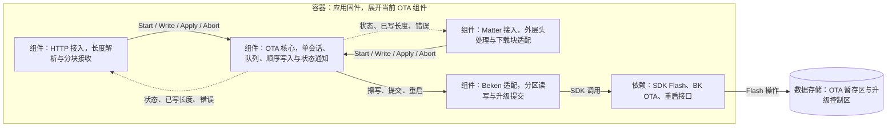
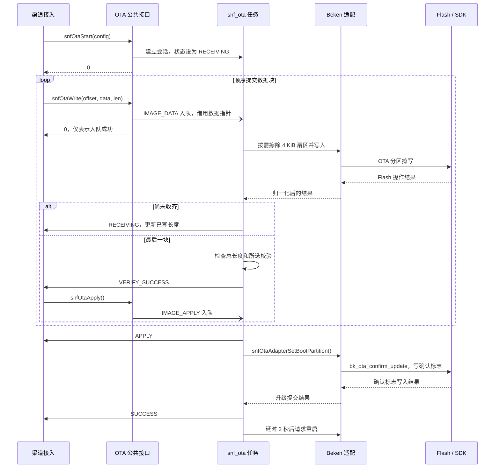
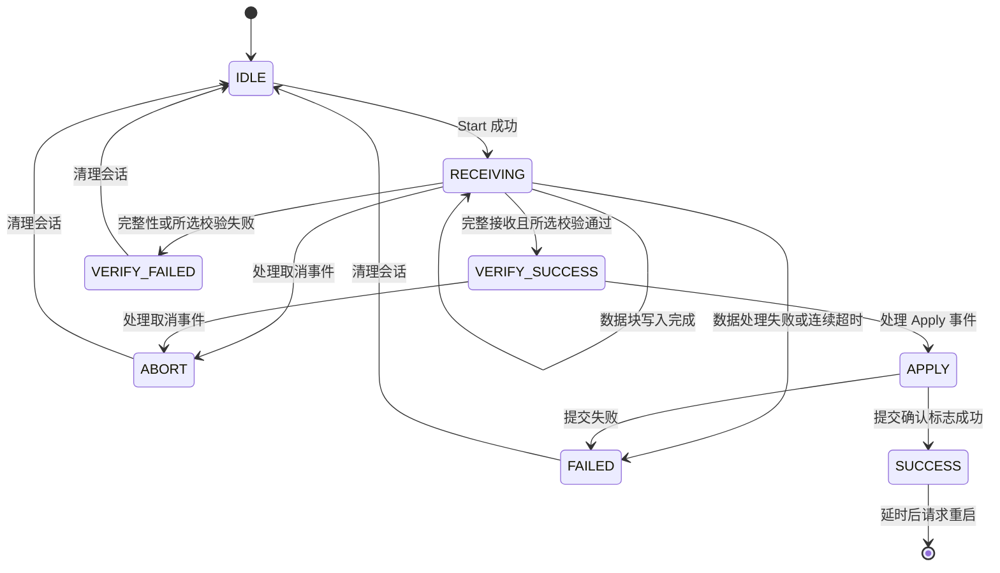
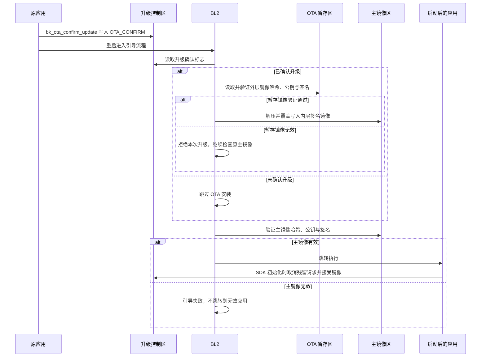

# OTA 升级架构与流程

HTTP 与 Matter 共用 Sonoff OTA 核心，负责接收数据、顺序写入暂存分区、提交升级并重启。**当前构建已启用安全固件、BL2 签名验证和 OVERWRITE 覆盖升级；HTTP/Matter 对新 BK OTA 包的接收适配仍需补齐。**

本篇以当前 `build_tool/config/bk7239n/` 配置、`sonoff/ota/` 实现及项目 SDK 覆盖代码为基线。C4 说明设备内外的职责边界，UML 说明接收、升级提交和重启后安装；计划中的渠道打包与解析单独标明。

## 1. 系统上下文与运行单元（C4 L1 / L2）

系统边界是 Sonoff 设备。外部升级包由发布侧提供，设备通过本地 HTTP 上传或 Matter OTA Requestor 接收。

| 外部对象 | 交互 | 包的约定 |
| --- | --- | --- |
| 发布 / 构建环境 | 编译、签名、打包升级产物 | 当前使用 BK 安全打包工具和 AWS KMS ECDSA P-256 签名适配 |
| 用户的浏览器 | 通过 Wi-Fi/HTTP 向设备上传文件 | 目标约定：使用基础 BK OTA 包 `ota.bin`；当前入口尚未解析其 BK 包头 |
| Matter OTA Provider | 向设备的 OTA Requestor 提供升级数据 | 目标约定：Matter 工具在同一基础 `ota.bin` 外添加 Matter 头 |



应用固件与 BL2 是不同的部署产物，在重启前后分别执行接收和安装职责。`snf_ota`、协议接入任务及 SDK 库均是应用固件内部实现，不另划为 C4 容器。

BL1/BootROM 对 BL2 的信任建立属于安全启动配置和设备生产部署范围。生成签名产物或启用编译宏，不等于已经验证设备的 OTP/eFuse 烧录状态。

## 2. 应用侧组件（C4 L3）



图示为已有组件，实线表示调用，虚线表示回调；不包含尚未接入的共用 BK 包头解析。

| 组件 | 职责与源码入口 |
| --- | --- |
| HTTP 接入 | [sonoff_ota_http.c](../sonoff/ota/sonoff_ota_http.c)：解析 `Content-Length`、分块接收、等待写入、返回上传结果 |
| Matter 接入 | [OTAImageProcessorImpl.cpp](../sonoff_modify/matter_modify/connectedhomeip/src/platform/Beken/OTAImageProcessorImpl.cpp)：处理 Matter 头与下载块；[sonoff_ota_matter.c](../sonoff/ota/sonoff_ota_matter.c)：对接核心并等待写入 |
| OTA 核心 | [sonoff_ota.c](../sonoff/ota/sonoff_ota.c)、[sonoff_ota.h](../sonoff/ota/sonoff_ota.h)：单会话、顺序/长度检查、按需擦除、状态通知 |
| Beken 适配 | [sonoff_ota_adapter.c](../sonoff/ota/sonoff_ota_adapter.c)：分区边界检查、Flash 操作、`bk_ota_confirm_update()` 和重启 |
| BL2 升级执行 | [ow_loader.c](../bk_openthread/bk_idk/components/bk_mcuboot/bl2/components/mcuboot/src/ow_loader.c)：确认标志、暂存镜像验证、覆盖安装和主镜像验证 |

HTTP 和 Matter 共享同一核心会话；已有 OTA 任务时再次 `Start` 返回 `BUSY`。两条入口目前都会在 `VERIFY_SUCCESS` 回调中自动调用 `snfOtaApply()`。

## 3. 升级包、签名与渠道适配

### 3.1 当前安全构建基线

配置来源为 [config](../build_tool/config/bk7239n/config)、[security.csv](../build_tool/config/bk7239n/security.csv)、[ota.csv](../build_tool/config/bk7239n/ota.csv) 和 [pack.json](../build_tool/config/bk7239n/pack.json)。

| 能力 | 当前配置与行为 |
| --- | --- |
| 安全固件与 BL2 | `SECURITY_FIRMWARE=y`、`BL2=y`、`TFM=n` |
| 升级策略 | `BL2_UPGRADE_STRATEGY="OVERWRITE_ONLY"`，安装时覆盖主镜像 |
| 验证策略 | `VALIDATE_IMAGE=y`、`VALIDATE_IMAGE_HASH_ONLY=n`、`BL2_SKIP_VALIDATE=n`；执行哈希和签名验证，普通启动也验证主镜像 |
| 验证启用条件 | `BL2_VALIDATE_ENABLED_BY_EFUSE=n`；当前 BL2 验证不等待该 eFuse 开关决定是否启用 |
| 升级提交 | `BK_OTA=y`、`BK_OTA_NEW_PACK_TOOL=y`、`OTA_CONFIRM_UPDATE=y` |
| 公钥信任 | [BL2 项目覆盖实现](../sonoff_modify/idk_modify/components/bk_mcuboot/bl2/components/mcuboot/src/ow_pubkey.c) 校验镜像公钥必须等于内置可信公钥，再参与验签 |
| 当前关闭项 | 固件加密、防降级、公钥更新/备份、BL2 随应用升级均未启用 |

`CONFIG_OTA_HTTP=n` 控制 SDK 对应的 OTA HTTP 功能，不会关闭 Sonoff 自己的 HTTP 服务及上传接口。下载传输、应用层完整性检查和 BL2 签名验证是不同职责。

签名侧使用 [AWS KMS 适配](../sonoff_modify/idk_modify/tools/env_tools/bksecure/tools/mcuboot_tools/imgtool/keys/aws_kms.py)调用签名服务，并用配置的公钥在本地验证返回签名。BL1 manifest 签名、应用镜像签名与 OTA 外层签名属于构建过程，设备接收过程不调用 KMS。

### 3.2 基础包与发布产物

当前 OVERWRITE 打包先签名应用镜像，再压缩该签名镜像并添加外层签名，最后添加 BK OTA 传输头。当前单镜像包可表示为：

```text
ota.bin
├─ BK OTA 全局头：32 字节，magic 为 BK723658
├─ BK OTA 镜像头：32 字节，描述长度、偏移、目标位置、CRC 等
└─ BL2 可识别的签名压缩镜像
   ├─ 外层镜像头、压缩数据及签名 TLV
   └─ 压缩数据解开后得到内层已签名应用镜像
```

全局头和镜像头是传输封装，不应原样写到 BL2 期待镜像头的位置。当前单镜像包的有效载荷从文件偏移 **64** 开始；后续解析应依据包头字段，而不是把 64 当作所有包格式的固定规则。

| 产物 | 用途 |
| --- | --- |
| `bootloader.bin` | BL1 下载格式的引导包，含控制数据、manifest 和 BL2；用于对应的生产部署流程 |
| `all-app.bin` | BL1 下载格式的分区表及应用包；当前 `pack.json` 未将 `bootloader.bin` 合并进来 |
| `app_signed.bin` | 工具内部带 `pack_header` 的已签名应用中间产物，不是 HTTP/Matter 的统一渠道包 |
| `ota.bin` | `PACK_OTA_BIN` 生成的基础 BK OTA 包，包含传输头和签名压缩镜像 |
| Matter 渠道包 | 计划由 Matter 工具在同一 `ota.bin` 外封装 Matter 头，再交给 Provider 发布 |

### 3.3 已明确的渠道目标与当前差距

**统一基础包，渠道只增加自己的外层封装。** 后续脚本将统一构建基础 BK OTA 包，再生成 Matter 及其他渠道所需产物。Matter 头剥离后，应得到与 HTTP 使用的完全相同的 BK OTA 包。

| 环节 | 当前实现 | 待补齐部分 |
| --- | --- | --- |
| HTTP 上传 | `POST /cgi/ota_upload`，有效 `Content-Length`，请求体按原字节顺序提交核心 | 解析 BK 全局头/镜像头，校验长度与目标范围，只将对应载荷送入写入链路 |
| Matter 下载 | 已调用 Matter 头解析器，随后仍按旧 `ota_data_struct_t` 读取版本及 `size_package` | 将旧 RBL 包头处理替换为与 HTTP 共用的 BK OTA 包处理 |
| OTA 核心及适配 | 支持顺序写入 `BK_PARTITION_OTA` 并提交 BK 升级确认标志 | 明确基础包解析与核心的交接契约，核心接收长度应对应实际落盘载荷 |
| 一键打包 | 已有安全签名打包基础能力 | 将基础包及各渠道外层封装整合为统一脚本 |

当前不能把生成的 `ota.bin` 直接视作已兼容 Sonoff HTTP/Matter 入口：HTTP 会把 BK 传输头一并写入，填满分区的签名载荷再加包头还可能越界；Matter 仍使用旧内层头布局。下面的应用核心和 BL2 时序分别描述已有代码能力，不代表渠道迁移已完成。

## 4. 应用侧接收与提交（UML）

### 4.1 核心接口契约

| 接口 | 调用约束 |
| --- | --- |
| `snfOtaStart(config)` | 复制配置，建立本次会话的队列和任务，进入 `RECEIVING` |
| `snfOtaWrite(offset, data, len)` | 异步入队；偏移从 0 连续递增；不复制数据，需保持缓冲内容不变直到对应写入回调 |
| `snfOtaApply()` | 仅在 `VERIFY_SUCCESS` 时允许，投递升级提交事件 |
| `snfOtaAbort()` | 取消事件按队列顺序处理，不能打断正在执行的 Flash 操作或重启处理 |

接口返回 `0` 表示请求被接受，最终结果由 OTA 任务同步调用状态回调通知；回调参数仅在回调期间有效。HTTP/Matter 写入封装等待已写长度更新后再复用缓冲区。失败后不能把同一指针仍在队列中等同于已经停止使用，应通过取消/结束流程管理生命周期。

### 4.2 核心正常路径

下图从入口已准备好待写数据开始；在新安全方案中，待写数据必须是解析基础包后得到的有效载荷。



### 4.3 状态语义与失败路径

| 状态 | 当前能确认的事实 |
| --- | --- |
| `RECEIVING` | 正在接收；进度按已成功写入的字节更新 |
| `VERIFY_SUCCESS` | 总长度完整且核心所选校验通过；当前入口均为 `CHECK_NONE`，不是 ECDSA 验签成功 |
| `APPLY` | 正在提交升级确认标志 |
| `SUCCESS` | 应用侧升级提交返回成功，随后将请求重启；不是新镜像已安装或业务已正常运行 |

`CHECK_SHA256` 目前是预留分支，返回不支持。真正的启动镜像哈希与签名验证发生在 BL2。



失败或取消后，核心任务删除队列、复位会话并退出，复位到 `IDLE` 不额外通知。取消不等于清空整个 OTA 分区；下一次会话仍按需擦除并重新写入，当前没有应用接收阶段的断点续传。

## 5. 重启后验证与覆盖安装（UML）

本节以 OTA 分区中已经存在合法的签名压缩镜像为前提，描述当前 BL2 的主要路径。



该图省略解压/Flash 故障等底层分支；覆盖过程失败不等于可以恢复旧主镜像。`OVERWRITE_ONLY` 不提供 A/B 试运行回退。SDK 有解压续传机制，但它与 HTTP/Matter 下载续传是不同阶段的能力。

当前非深睡唤醒的 [SDK 初始化流程](../bk_openthread/bk_idk/components/bk_init/bk_init.c) 调用 `bk_ota_cancel_update(0)`、`bk_ota_accept_image()` 完成标志处理。`OTA_CONFIRM_UPDATE` 在此用于**重启前允许执行升级**；不是由私有项目在业务健康检查通过后确认运行成功。

## 6. 分区、运行参数与接手重点

以下为 [当前分区表](../build_tool/config/bk7239n/partitions.csv)中的物理 Flash 地址；签名工具还涉及虚拟地址及 CRC 布局，不能混用。

| 分区 | 物理起始地址 | 大小 | 用途 |
| --- | --- | --- | --- |
| `bl2` | `0x005000` | 96 KiB | BL2 引导固件，本次应用 OTA 不更新它 |
| `primary_cpu0_app` | `0x01D000` | 2332 KiB | 主应用镜像 |
| `ota` | `0x264000` | 1492 KiB | 签名压缩镜像暂存区 |
| `ow_ota_control` | `0x3D9000` | 4 KiB | OVERWRITE 控制信息；确认标志位于最后 4 字节，即 `0x3D9FFC` |

| 运行参数 | 当前值 |
| --- | --- |
| 核心事件队列 | 10 个事件 |
| HTTP 数据缓冲 | 1 KiB |
| 按需擦除粒度 | 4 KiB |
| 核心接收超时 | 连续 3 次、每次 20 秒等待事件超时后失败 |
| HTTP / Matter 写入等待 | 当前 1 kHz tick 配置下分别约 30 / 20 秒；实现直接比较 tick 差值 |
| 提交后重启延时 | 2 秒 |

接手时先验证渠道包解析和落盘布局，再验证提交标志及 BL2 安装；不能仅以网页上传成功或 `SNF_OTA_STATE_SUCCESS` 作为升级完成依据。错误码和状态回调需结合两个阶段的日志定位：应用侧负责传输/Flash/提交错误，BL2 负责信任验证和安装结果。

本文说明当前源码与配置，不将尚未完成的渠道迁移、一键发布脚本或板端升级验证写作已完成能力。
