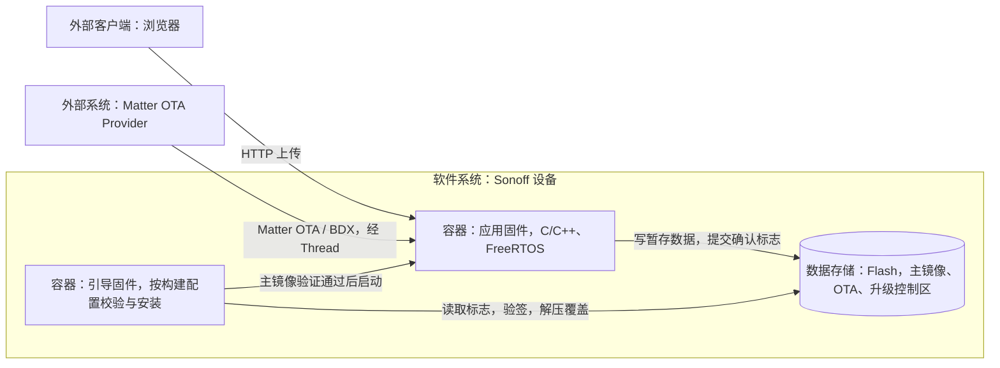
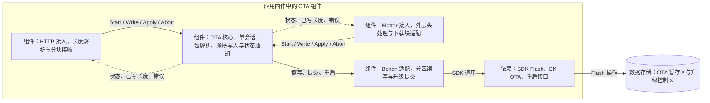
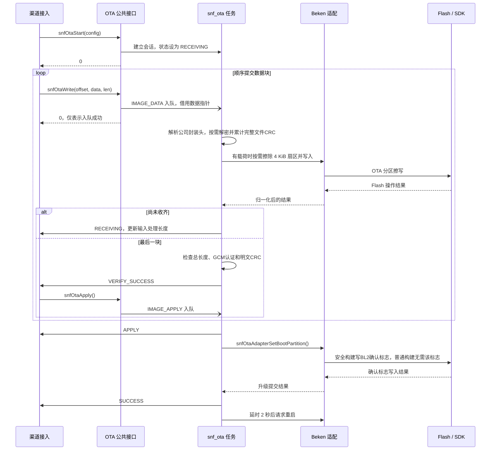
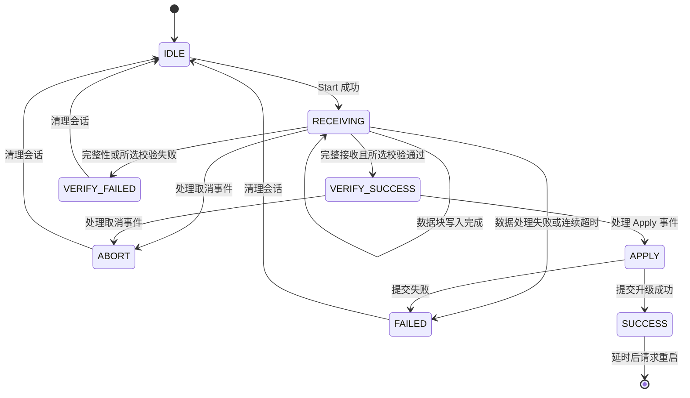
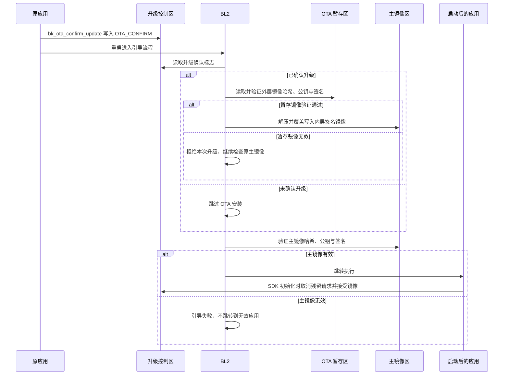

# OTA 升级架构与流程

HTTP 与 Matter 共用 Sonoff OTA 核心。**不带 `SE=1` 编译普通固件，SDK 生成 `app_pack.rbl`；`SE=1` 编译安全固件，SDK 生成 `ota.bin` 和可直接写入 OTA 分区的 `ota_raw.bin`。外层打包选用普通构建的 `app_pack.rbl` 或安全构建的 `ota_raw.bin`，只读取所选原产物，另行输出 `ota_encrypted.bin`，不改写 SDK 原产物。**

本篇以当前 `build_tool/config/bk7239n/` 配置、`sonoff/ota/` 实现及项目 SDK 覆盖代码为基线。C4 说明设备内外的职责边界，UML 说明接收、升级提交和重启后安装；尚未完成的渠道打包单独标明。

## 1. 设备与外部交互

系统边界是 Sonoff 设备。外部升级包由发布侧提供，设备通过本地 HTTP 上传或 Matter OTA Requestor 接收。


| 外部对象                | 交互                        | 包的约定                                     |
| ------------------- | ------------------------- | ---------------------------------------- |
| 发布 / 构建环境           | 编译、签名、打包升级产物              | 普通构建生成 RBL；安全构建使用 BK 安全打包工具和 AWS KMS 签名适配 |
| 用户的浏览器              | 通过 Wi-Fi/HTTP 向设备上传文件     | 带公司外层封装的 OTA 包          |
| Matter OTA Provider | 向设备的 OTA Requestor 提供升级数据 | Matter 头内为带公司外层封装的 OTA 包          |





应用固件与引导固件是不同的部署产物，在重启前后分别执行接收和安装职责。`snf_ota`、协议接入任务及 SDK 库均是应用固件内部实现，不另划为 C4 容器。

BL1/BootROM 对 BL2 的信任建立属于安全启动配置和设备生产部署范围。生成签名产物或启用编译宏，不等于已经验证设备的 OTP/eFuse 烧录状态。

## 2. 应用侧组件




图示为已有组件，实线表示调用，虚线表示回调。公司外层封装解析由 HTTP/Matter 共用的 OTA 核心完成；文件内容原样写入，平台镜像格式由 SDK/bootloader 处理。


| 组件        | 职责与源码入口                                                                                                                                                                                                     |
| --------- | ----------------------------------------------------------------------------------------------------------------------------------------------------------------------------------------------------------- |
| HTTP 接入   | [sonoff_ota_http.c](../sonoff/ota/sonoff_ota_http.c)：解析 `Content-Length`、分块接收、等待写入、返回上传结果                                                                                                                   |
| Matter 接入 | [OTAImageProcessorImpl.cpp](../sonoff_modify/matter_modify/connectedhomeip/src/platform/Beken/OTAImageProcessorImpl.cpp)：处理 Matter 头与下载块；[sonoff_ota_matter.c](../sonoff/ota/sonoff_ota_matter.c)：对接核心并等待写入 |
| OTA 核心    | [sonoff_ota.c](../sonoff/ota/sonoff_ota.c)、[sonoff_ota.h](../sonoff/ota/sonoff_ota.h)：单会话、顺序/长度检查、按需擦除、状态通知；[sonoff_ota_parse.c](../sonoff/ota/sonoff_ota_parse.c) 负责公司元数据、文件选择、解密认证、外层 CRC 和分区容量校验                  |
| Beken 适配  | [sonoff_ota_adapter.c](../sonoff/ota/sonoff_ota_adapter.c)：分区边界检查、Flash 操作、`bk_ota_confirm_update()` 和重启                                                                                                    |
| BL2 升级执行  | [ow_loader.c](../bk_openthread/bk_idk/components/bk_mcuboot/bl2/components/mcuboot/src/ow_loader.c)：确认标志、暂存镜像验证、覆盖安装和主镜像验证                                                                                  |


HTTP 和 Matter 共享同一核心会话；已有 OTA 任务时再次 `Start` 返回 `BUSY`。两条入口目前都会在 `VERIFY_SUCCESS` 回调中自动调用 `snfOtaApply()`。

## 3. 升级包、签名与渠道适配


### 3.1 普通构建与安全构建

[config](../build_tool/config/bk7239n/config) 保存公共配置，普通配置位于 [normal/](../build_tool/config/bk7239n/normal/)，安全配置位于 [secure/](../build_tool/config/bk7239n/secure/)。Makefile 按 `SE` 组合对应配置到构建目录，再调用 SDK 原有编译流程。普通与安全构建分别使用 `build/` 和 `build/secure/`，隔离配置、缓存与产物。

普通构建由 bootloader 根据 OTA 分区中的 RBL 头执行校验、解密、解压和安装，不使用 BL2 确认标志。以下配置表与签名说明仅适用于 `SE=1`：


| 能力        | 当前配置与行为                                                                                                                       |
| --------- | ----------------------------------------------------------------------------------------------------------------------------- |
| 安全固件与 BL2 | `SECURITY_FIRMWARE=y`、`BL2=y`、`TFM=n`                                                                                         |
| 升级策略      | `BL2_UPGRADE_STRATEGY="OVERWRITE_ONLY"`，安装时覆盖主镜像                                                                              |
| 验证策略      | `VALIDATE_IMAGE=y`、`VALIDATE_IMAGE_HASH_ONLY=n`、`BL2_SKIP_VALIDATE=n`；执行哈希和签名验证，普通启动也验证主镜像                                    |
| 验证启用条件    | `BL2_VALIDATE_ENABLED_BY_EFUSE=n`；当前 BL2 验证不等待该 eFuse 开关决定是否启用                                                                |
| 升级提交      | `BK_OTA=y`、`BK_OTA_NEW_PACK_TOOL=y`、`OTA_CONFIRM_UPDATE=y`                                                                    |
| 公钥信任      | [BL2 项目覆盖实现](../sonoff_modify/idk_modify/components/bk_mcuboot/bl2/components/mcuboot/src/ow_pubkey.c) 校验镜像公钥必须等于内置可信公钥，再参与验签 |
| 当前关闭项     | BK Flash 固件加密、防降级、公钥更新/备份、BL2 随应用升级均未启用；OTA 传输包可使用 AES-256-GCM                                                                                                |


`CONFIG_OTA_HTTP=n` 控制 SDK 对应的 OTA HTTP 功能，不会关闭 Sonoff 自己的 HTTP 服务及上传接口。下载传输、应用层完整性检查和 BL2 签名验证是不同职责。

签名侧使用 [AWS KMS 适配](../sonoff_modify/idk_modify/tools/env_tools/bksecure/tools/mcuboot_tools/imgtool/keys/aws_kms.py)调用签名服务，并用配置的公钥在本地验证返回签名。BL1 manifest 签名、应用镜像签名与 OTA 外层签名属于构建过程，设备接收过程不调用 KMS。

### 3.2 基础包与发布产物

安全构建的 OVERWRITE 打包先签名应用镜像，再压缩该签名镜像并添加外层签名，最后添加 BK OTA 传输头。该单镜像包可表示为：

```text
ota.bin
├─ BK OTA 全局头：32 字节，magic 为 BK723658
├─ BK OTA 镜像头：32 字节，描述长度、偏移、目标位置、CRC 等
└─ BL2 可识别的签名压缩镜像
   ├─ 外层镜像头、压缩数据及签名 TLV
   └─ 压缩数据解开后得到内层已签名应用镜像
```

安全构建同时通过 SDK 的 `PACK_RAW_OTA_BIN` 生成 `ota_raw.bin`，其中直接包含 BL2 所需的签名压缩镜像。公司外层打包选用该产物；原有 `ota.bin` 仍由 `PACK_OTA_BIN` 生成并保留。Sonoff 解析器和外层打包脚本均不解析或剥离 BK 传输头。


| 产物               | 用途                                                       |
| ---------------- | -------------------------------------------------------- |
| `bootloader.bin` | BL1 下载格式的引导包，含控制数据、manifest 和 BL2；用于对应的生产部署流程            |
| `all-app.bin` | SDK 原有烧录产物，布局由对应构建配置决定，外层打包不修改它 |
| `app_signed.bin` | 工具内部带 `pack_header` 的已签名应用中间产物，不是 HTTP/Matter 的统一渠道包     |
| `ota.bin`        | `PACK_OTA_BIN` 生成的基础 BK OTA 包，包含传输头和签名压缩镜像               |
| `app_pack.rbl` | 普通构建的原始 OTA 包，含 96 字节 RBL 头和固件数据 |
| `ota_raw.bin` | 安全构建由 SDK `PACK_RAW_OTA_BIN` 生成的可直接写入 OTA 分区的镜像 |
| `ota_encrypted.bin` | 对 `SE` 对应的可直接写入产物添加公司封装及 AES-256-GCM 加密，供 HTTP 上传或继续添加渠道头 |
| Matter 渠道包       | 由 Matter 工具在 `ota_encrypted.bin` 外添加 Matter 头；当前构建尚未自动生成 |


### 3.3 带封装的 OTA 包与接入路径

```text
HTTP → 公司外层 OTA 包 → OTA 核心
Matter → Matter 头剥离 → 公司外层 OTA 包 → OTA 核心
OTA 核心 → 校验元数据、文件属性和容量 → 按文件名选择 → 按加密类型解密
选中的完整明文文件 → 从 OTA 分区偏移 0 顺序原样写入
接收完整且外层 CRC/GCM 认证通过 → Apply 调用平台提交接口 → 重启后由平台安装
```

带封装的 OTA 包格式见 [OTA 文件结构说明](OTA文件结构V2.1.pdf)，由 24 字节元数据头、N × 76 字节文件属性和文件内容组成。外层封装中的整数为大端序；文件内容不作格式解释。

各字段均保存在解析结果中，以下偏移分别相对元数据头或单个文件属性的起点：

| 所属结构 | 偏移 | 字节数 | 字段 | 解析结果成员 |
| --- | --- | --- | --- | --- |
| 元数据头 | 0 | 1 | 结构版本 | `SnfOtaMetadata.version` |
| 元数据头 | 1 | 1 | 文件个数 | `SnfOtaMetadata.file_count` |
| 元数据头 | 2 | 8 | 联合版本号 | `SnfOtaMetadata.model_version` |
| 元数据头 | 10 | 1 | 加密类型：0 未加密，1 AES-256-GCM | `SnfOtaMetadata.cipher_type` |
| 元数据头 | 11 | 9 | 预留字段 | `SnfOtaMetadata.reserved` |
| 元数据头 | 20 | 4 | 头部 CRC | `SnfOtaMetadata.crc` |
| 文件属性 | 0 | 32 | 文件名 | `SnfOtaFileInfo.name` |
| 文件属性 | 32 | 16 | 文件版本号 | `SnfOtaFileInfo.version` |
| 文件属性 | 48 | 4 | 文件起始位置 | `SnfOtaFileInfo.offset` |
| 文件属性 | 52 | 4 | 包内文件长度，加密时包括 IV 和标签 | `SnfOtaFileInfo.size` |
| 文件属性 | 56 | 4 | 加密前完整文件的 CRC | `SnfOtaFileInfo.crc` |
| 文件属性 | 60 | 4 | 文件属性 CRC | `SnfOtaFileInfo.attributes_crc` |
| 文件属性 | 64 | 12 | 预留字段 | `SnfOtaFileInfo.reserved` |


| 校验对象       | 覆盖范围                                  | CRC32 规则                          |
| ---------- | ------------------------------------- | --------------------------------- |
| OTA 包元数据头     | 头部前 20 字节，包含联合版本号和预留区                 | IEEE CRC32，初值和最终异或均为 `0xFFFFFFFF` |
| OTA 包文件属性     | 属性前 60 字节，不含属性 CRC 及尾部 12 字节预留区       | 同上                                |
| 选中的目标文件    | 加密前的完整文件，不含公司封装的 IV 和标签 | 同上，分块累计                           |


元数据头原预留区的首字节（偏移 10）作为加密类型；偏移 11～19 的 9 字节、文件属性偏移 64～75 的 12 字节仍原样保存到 `reserved`。预留字段不要求全零，未知加密类型会被拒绝。加密类型和头部预留区参与头部 CRC，文件属性末尾预留区不参与属性 CRC。解析结果结构体用于保存字段值，不可通过 `sizeof` 或强制转换代替线上 24/76 字节布局。

HTTP/Matter 显式将 `SnfOtaConfig.file_name` 填为 `SNF_OTA_DEFAULT_FILE_NAME`（`ota.bin`）；其他调用方可指定目标文件名。包模式必须提供非空文件名，解析器拒绝 NULL 或首字节为 0 的输入，校验后完整复制 32 字节。版本字符串按原字段读取并补结束符，不转成整数，也不在此添加应用版本升级策略。

文件表须按偏移递增且不重叠。所有文件属性均校验 CRC 和输入边界；仅选中的文件校验内容 CRC 并写入。未命中、重复目标、越界、未知结构版本或所选文件明文长度超过分区容量时失败。完整输入处理完毕且 GCM 认证（加密包）与明文累计 CRC 均通过后，才通知 `VERIFY_SUCCESS`；不会因目标文件位于包中间而提前提交升级。

所选文件的明文长度必须非零且不超过 OTA 分区容量，加密文件扣除 IV 和标签后检查容量。公司层不检查镜像 magic、内部版本、目标地址、算法标志或内部 CRC，也不剥离、改写或延迟补写内部头部。发布侧应选用平台提供的可直接写入 OTA 分区的镜像。带封装的 OTA 包可有多个文件，但本模块仅提取当前芯片的一个升级文件，不分发协同固件，也不解析示意图中其他芯片使用的 Zigbee 内层格式。Matter 自身的头由 Matter SDK 解析器处理。

本项目的线上结构版本统一使用 `1`，由 `SNF_OTA_STRUCT_VERSION` 和打包脚本的 `STRUCT_VERSION` 定义。

现有 `SnfOtaConfig` 零初始化仍表示 `SNF_OTA_FORMAT_RAW`，保持原始镜像直接写入行为；HTTP/Matter 显式使用 `SNF_OTA_FORMAT_PACKAGE`，只接受公司外层包；不再根据文件 magic 自动识别裸平台镜像。包模式自带 CRC 校验和按头部加密类型选择的解密流程，入口的 `image_info.check_type`、`image_info.cipher_type` 仍传 `NONE`，实际加密类型以 `SnfOtaMetadata.cipher_type` 为准。

### 3.4 加密文件内容与解密流程

加密类型为 1 时，每个文件内容独立使用 AES-256-GCM：

```text
文件属性 offset 指向这里
├─ IV：12 字节，每次打包每个文件独立随机生成
├─ 密文：原始文件加密结果，长度等于原始文件长度
└─ Tag：16 字节认证标签
```

`file.size = 明文长度 + 12 + 16`；`file.crc` 是加密前完整文件的 CRC32。算法与格式说明一致：多项式 `0x04C11DB7`（反射形式 `0xEDB88320`），初值 `0xFFFFFFFF`，最终异或 `0xFFFFFFFF`。设备复用 SDK CRC32 累计计算，打包端使用等价的 `zlib.crc32()`。平台内部的 CRC 由平台处理。

GCM 的 AAD 为原始 24 字节元数据头拼接当前文件的完整 76 字节属性，包含加密类型、文件名、版本、偏移、长度、CRC 和预留字段。密钥不放入升级包。

设备复用 `sonoff_aes_gcm` 的流式解密接口，每次最多解密 512 字节，不修改接入通道提供的输入缓冲区。解密后的完整文件参与明文 CRC，所有字节按原顺序直接写入 OTA 暂存分区。接收过程中暂存区可能已有部分或完整文件；失败、超时或中止时不会请求 Apply，平台负责自己的镜像有效性判断和安装行为。Tag 校验前的暂存数据不能提交升级；错密钥、Tag/AAD/密文被修改、明文 CRC 错误和截断均会使升级失败。成功、失败、超时和中止后释放 GCM 上下文。

### 3.5 密钥与构建打包

`sonoff/ota/sonoff_ota_key.h` 是唯一密钥来源，随源码纳入 Git 管理。文件中的 `static const uint8_t ota_aes_key[32]` 使用 32 个十六进制字节定义固定密钥；OTA 模块直接包含该头文件用于解密，`build_tool/ota/pack_ota.py` 使用 Python `cryptography`，读取同一个数组进行加密打包。构建只读取密钥头文件，不生成或改写密钥，工具和设备日志均不输出密钥内容。

头文件缺失或密钥数组格式、长度不正确时，加密打包报错。后续版本继续使用该头文件中的同一密钥；每次打包仍为每个文件生成独立随机 IV。首次部署加密支持的固件仍需通过设备当时支持的烧录或未加密升级路径完成。

```sh
# 普通固件：SDK生成app_pack.rbl，再从该原产物生成外层加密包
make -C build_tool MODEL=onoff_plug

# 安全固件：SDK生成ota_raw.bin，再从该原产物生成外层加密包
make -C build_tool MODEL=onoff_plug SE=1

# 只做外层打包，SE必须与原产物的构建模式一致
make -C build_tool MODEL=onoff_plug ota_package
make -C build_tool MODEL=onoff_plug SE=1 ota_package
```

普通构建输出 `build/bk7239n/onoff_plug/package/ota_encrypted.bin`，安全构建输出 `build/secure/bk7239n/onoff_plug/package/ota_encrypted.bin`。Makefile 根据 `SE` 明确选择原始 `app_pack.rbl` 或 `ota_raw.bin`，不按文件是否存在或构建摘要猜测。封装内逻辑文件名统一为 `ota.bin`，实际内容为平台提供的可直接写入镜像；联合版本和文件版本取自 `SONOFF_SOFTWARE_VERSION_STRING`。原始 OTA 文件和烧录文件均保留不变。加密封装完成后，Matter 渠道仍需在该文件外添加 Matter 头。

需要未加密封装时，可显式指定：

```sh
python3 build_tool/ota/pack_ota.py pack --cipher none \
    --input build/bk7239n/onoff_plug/package/app_pack.rbl \
    --output build/bk7239n/onoff_plug/package/ota_wrapped.bin \
    --version-header project/onoff_plug/inc/sonoff_project_config.h
```


## 4. 应用侧接收与提交


### 4.1 核心接口契约


| 接口                               | 调用约束                                        |
| -------------------------------- | ------------------------------------------- |
| `snfOtaStart(config)`            | 复制配置，复制输入总长度与格式，建立解析会话、队列和任务，进入 `RECEIVING` |
| `snfOtaWrite(offset, data, len)` | 异步入队；偏移从 0 连续递增；不复制数据，需保持缓冲内容不变直到对应写入回调     |
| `snfOtaApply()`                  | 仅在 `VERIFY_SUCCESS` 时允许，投递升级提交事件            |
| `snfOtaAbort()`                  | 取消事件按队列顺序处理，不能打断正在执行的 Flash 操作或重启处理         |


接口返回 `0` 表示请求被接受，最终结果由 OTA 任务同步调用状态回调通知；回调参数仅在回调期间有效。HTTP/Matter 写入封装等待输入处理长度更新后再复用缓冲区；该长度包含已解析的头部及跳过的文件，不等于 Flash 已写长度。失败后不能把同一指针仍在队列中等同于已经停止使用，应通过取消/结束流程管理生命周期。

### 4.2 核心正常路径

下图从入口提交包数据开始；OTA 工作任务先解析头部并定位载荷，再送入原有 Flash 擦写流程。




### 4.3 状态语义与失败路径


| 状态               | 当前能确认的事实                                |
| ---------------- | --------------------------------------- |
| `RECEIVING`      | 正在接收；进度按已成功处理的输入字节更新，包含头部与跳过的文件         |
| `VERIFY_SUCCESS` | 输入完整，头部/明文 CRC 通过，加密包 GCM 认证通过；ECDSA 验签由 BL2 执行 |
| `APPLY`          | 正在提交升级确认标志                              |
| `SUCCESS`        | 应用侧升级提交返回成功，随后将请求重启；不是新镜像已安装或业务已正常运行    |


`CHECK_SHA256` 目前是预留分支，返回不支持。真正的启动镜像哈希与签名验证发生在 BL2。




失败或取消后，核心任务删除队列、复位会话并退出，复位到 `IDLE` 不额外通知。取消不等于清空整个 OTA 分区；下一次会话仍按需擦除并重新写入，当前没有应用接收阶段的断点续传。

## 5. 重启后验证与覆盖安装

普通构建由 bootloader 检测 OTA 分区起点的 RBL magic，验证头部和固件数据 CRC，再按 RBL 标志解密、解压、搬运并校验固件。详见 [SDK 普通 OTA 流程](../bk_openthread/bk_idk/docs/bk7239n/zh_CN/developer-guide/bootloader_ota/bootloader_and_ota/bk_up_bootloader_and_ota.rst)。

以下图示仅适用于安全构建，以 OTA 分区中已存在合法的签名压缩镜像为前提，描述 BL2 的主要路径。




该图省略解压/Flash 故障等底层分支；覆盖过程失败不等于可以恢复旧主镜像。`OVERWRITE_ONLY` 不提供 A/B 试运行回退。SDK 有解压续传机制，但它与 HTTP/Matter 下载续传是不同阶段的能力。

安全构建中非深睡唤醒的 [SDK 初始化流程](../bk_openthread/bk_idk/components/bk_init/bk_init.c) 调用 `bk_ota_cancel_update(0)`、`bk_ota_accept_image()` 完成标志处理。`OTA_CONFIRM_UPDATE` 在此用于**重启前允许执行升级**；不是由私有项目在业务健康检查通过后确认运行成功。

## 6. 分区、运行参数与接手重点

普通构建使用 [normal/auto_partitions.csv](../build_tool/config/bk7239n/normal/auto_partitions.csv)：bootloader 位于 `0x000000`、68 KiB；应用位于 `0x011000`、2380 KiB；OTA 分区位于 `0x264000`、1496 KiB。运行时始终从 SDK 获取分区容量。

以下为 [安全构建分区表](../build_tool/config/bk7239n/secure/partitions.csv)中的物理 Flash 地址，仅在 `SE=1` 时适用：


| 分区                 | 物理起始地址     | 大小       | 用途                                        |
| ------------------ | ---------- | -------- | ----------------------------------------- |
| `bl2`              | `0x005000` | 96 KiB   | BL2 引导固件，本次应用 OTA 不更新它                    |
| `primary_cpu0_app` | `0x01D000` | 2332 KiB | 主应用镜像                                     |
| `ota`              | `0x264000` | 1492 KiB | 签名压缩镜像暂存区                                 |
| `ow_ota_control`   | `0x3D9000` | 4 KiB    | OVERWRITE 控制信息；确认标志位于最后 4 字节，即 `0x3D9FFC` |


| 运行参数               | 当前值                                           |
| ------------------ | --------------------------------------------- |
| 核心事件队列             | 10 个事件                                        |
| HTTP 数据缓冲          | 1 KiB                                         |
| 按需擦除粒度             | 4 KiB                                         |
| 核心接收超时             | 连续 3 次、每次 20 秒等待事件超时后失败                       |
| HTTP / Matter 写入等待 | 当前 1 kHz tick 配置下分别约 30 / 20 秒；实现直接比较 tick 差值 |
| 提交后重启延时            | 2 秒                                           |


接手时先验证渠道包解析和落盘布局，再验证提交标志及 BL2 安装；不能仅以网页上传成功或 `SNF_OTA_STATE_SUCCESS` 作为升级完成依据。错误码和状态回调需结合两个阶段的日志定位：应用侧负责传输/Flash/提交错误，BL2 负责信任验证和安装结果。

主机回归运行 `python3 tests/ota/test_ota.py`，覆盖头部任意分块、文件选择、CRC 错误、越界、截断、会话重启、加密打包与解密、GCM 篡改拒绝、固定密钥读取、任意文件原样落盘、分区容量边界以及 SE 构建配置和 SDK 原产物选择。测试使用实际 OTA 核心、解析器、AES-GCM 适配及 SDK CRC/GCM 实现，队列调度与 Flash 为替身；板端 HTTP/Matter 传输和 BL2 安装仍需实机验证。
