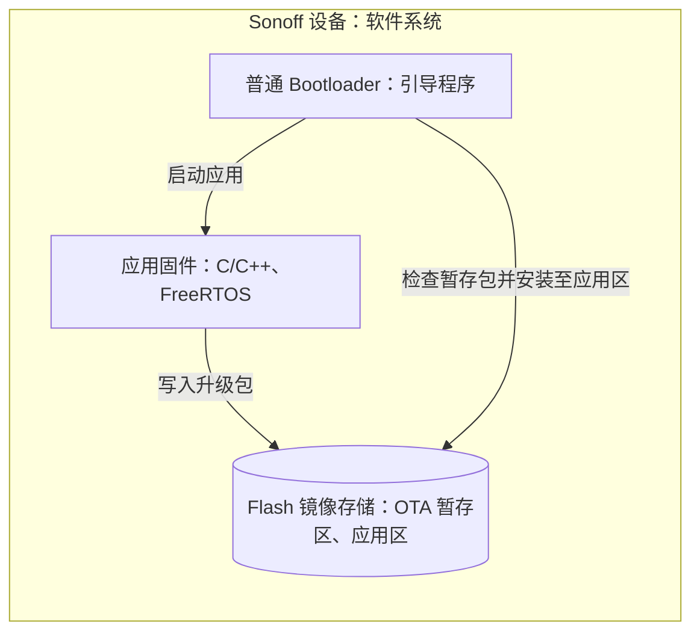
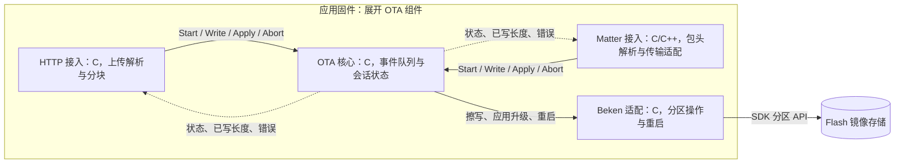
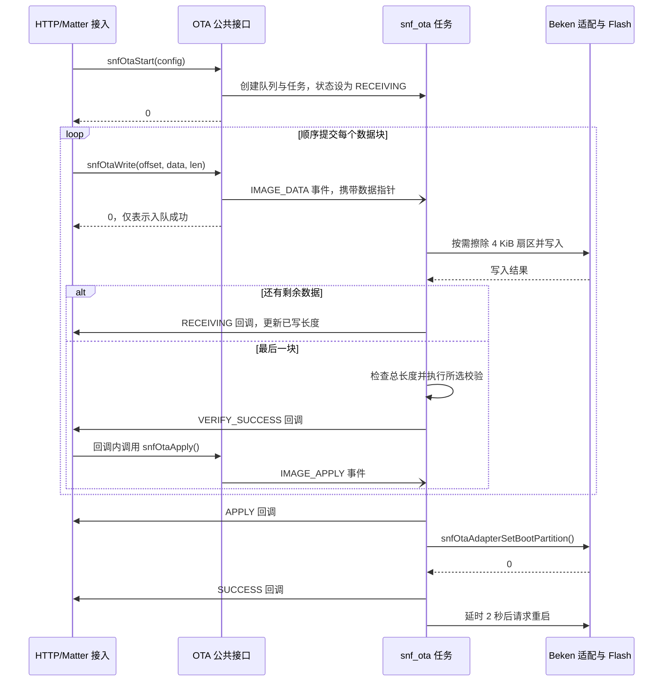
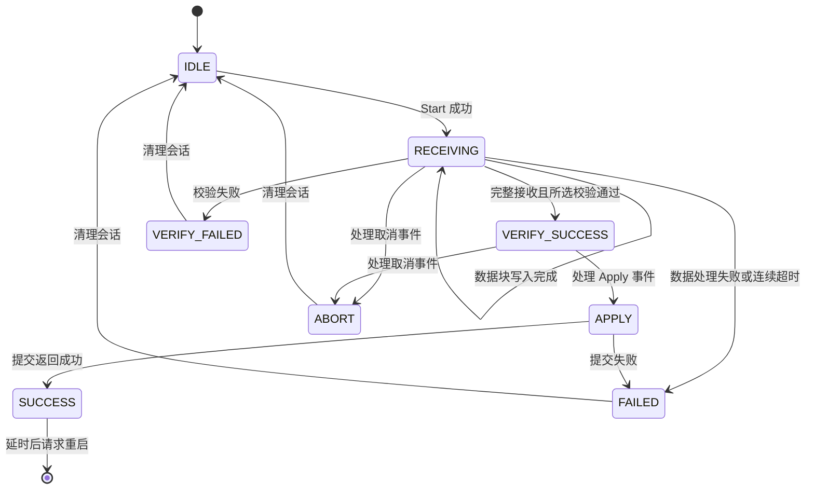

# OTA 流程与方案说明

**当前方案：HTTP 与 Matter 两个入口，共用一个 OTA 核心；升级包顺序写入 Flash 暂存区，接收完成后自动申请升级、重启，由 Bootloader 安装。** 安全启动与签名升级属于后续方案，见第 5 节。

## 1. 外部交互

系统边界为 Sonoff 设备，OTA 与外部的交互如下。

| 外部对象                | 与设备的交互                                    | 升级数据                      |
| ------------------- | ----------------------------------------- | ------------------------- |
| 用户的浏览器              | 在设备本地网页选择文件，通过 Wi-Fi/HTTP 上传              | 普通 Bootloader 支持的 RBL 升级包 |
| Matter OTA Provider | 设备的 OTA Requestor 通过 Matter/Thread 获取升级数据 | Matter OTA 外层封装 + RBL 载荷  |

HTTP 上传入口是 `POST /cgi/ota_upload`，请求体为文件二进制，必须携带有效的 `Content-Length`。Matter 接入先处理外层包头，再按内部 RBL 包头计算待写总长度。

## 2. 运行单元与存储

应用接收阶段只写 `BK_PARTITION_OTA`。重启后，普通 Bootloader 按 RBL 格式检查、解包并覆盖应用区；具体行为参见 [SDK 引导升级说明](../bk_openthread/bk_idk/docs/bk7239n/zh_CN/developer-guide/bootloader_ota/bootloader_and_ota/bk_up_bootloader_and_ota.rst)。

任务、队列和协议适配均属于应用固件内部实现。分区大小分别以 [普通分区配置](../build_tool/config/bk7239n/auto_partitions.csv) 和安全构建所用分区配置为准。

## 3. 模块划分与职责

实线表示调用或存储访问，虚线表示状态回调；所有 OTA 组件均在同一应用固件中运行。

| 组件        | 职责与源码                                                                                                                                                                                                |
| --------- | ---------------------------------------------------------------------------------------------------------------------------------------------------------------------------------------------------- |
| HTTP 接入   | 解析长度、分块接收、等待写入、返回上传结果：[sonoff_ota_http.c](../sonoff/ota/sonoff_ota_http.c)                                                                                                                           |
| Matter 接入 | [OTAImageProcessorImpl.cpp](../sonoff_modify/matter_modify/connectedhomeip/src/platform/Beken/OTAImageProcessorImpl.cpp) 处理包头和下载块，[sonoff_ota_matter.c](../sonoff/ota/sonoff_ota_matter.c) 对接核心并等待写入 |
| OTA 核心    | 管理单个会话、队列、顺序与长度检查、按需擦除、写入、状态通知：[sonoff_ota.c](../sonoff/ota/sonoff_ota.c)                                                                                                                            |
| Beken 适配  | 检查分区边界，封装 Flash 擦写、升级提交及重启：[sonoff_ota_adapter.c](../sonoff/ota/sonoff_ota_adapter.c)                                                                                                                |

HTTP 与 Matter 共用同一核心会话，核心已有任务时再次 `Start` 返回 `BUSY`。两条接入路径当前均在 `VERIFY_SUCCESS` 回调中调用 `snfOtaApply()`。

## 4. 升级流程与接口约束

### 4.1 接口契约

公共接口定义在 [sonoff_ota.h](../sonoff/ota/sonoff_ota.h)。

| 接口                               | 调用约束                                   |
| -------------------------------- | -------------------------------------- |
| `snfOtaStart(config)`            | 复制配置，创建本次会话的队列和任务，进入接收状态               |
| `snfOtaWrite(offset, data, len)` | 异步入队；偏移从 0 连续递增；不复制数据，缓冲区必须保留到对应写入回调   |
| `snfOtaApply()`                  | 仅在 `VERIFY_SUCCESS` 时允许，投递应用升级事件       |
| `snfOtaAbort()`                  | 投递取消事件，按队列顺序处理，不能打断正在执行的 Flash 操作或重启处理 |

接口返回 `0` 表示请求被接受；最终处理结果通过回调通知。回调在 **OTA 任务上下文**同步执行，事件参数仅在回调期间有效。HTTP/Matter 的写入封装等待已写长度更新后，再复用缓冲区。

### 4.2 正常升级时序

当前两条入口均使用 `CHECK_NONE`，因此 `VERIFY_SUCCESS` 表示数据长度完整并通过所选校验；SHA-256 分支仍返回“不支持”。`SUCCESS` 仅表示应用侧升级提交返回成功，新镜像是否安装并正常启动需在重启后确认。

### 4.3 会话状态与异常处理

图中状态名省略 `SNF_OTA_STATE_` 前缀，展示主要转换。

失败或取消后，任务删除队列、复位核心状态并退出；复位到 `IDLE` 不额外发送回调。

关键参数：队列深度 **10**；HTTP 数据缓冲 **1 KiB**；Flash 按需擦除 **4 KiB**；核心接收态连续 **3 次 × 20 秒**等待事件超时后失败；HTTP/Matter 写入等待上限分别为 **30/20 秒**（当前系统 tick 为 1 kHz）。

