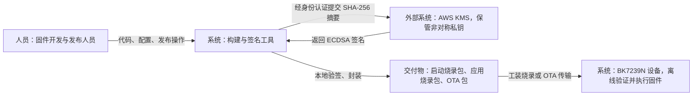
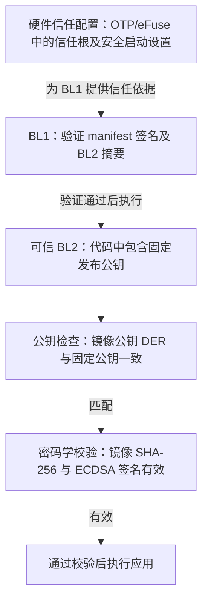
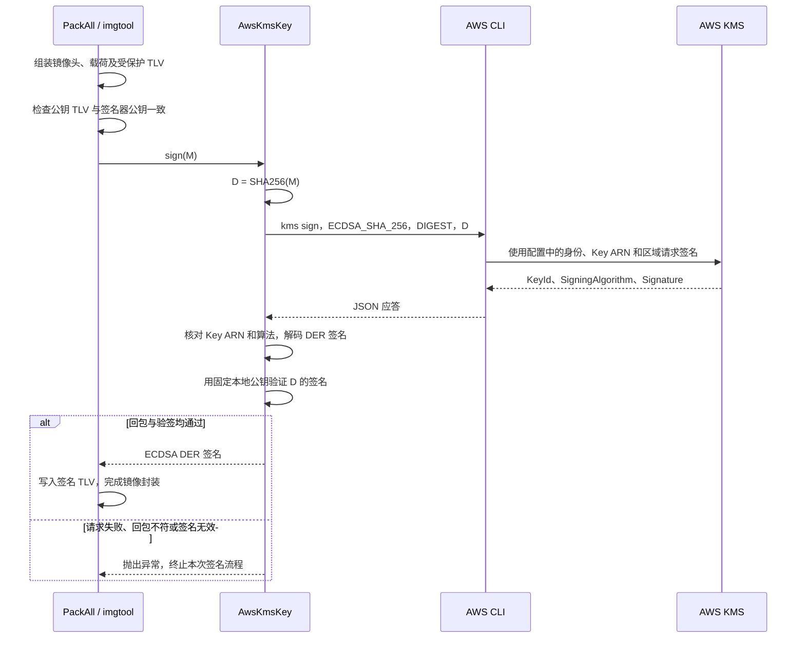
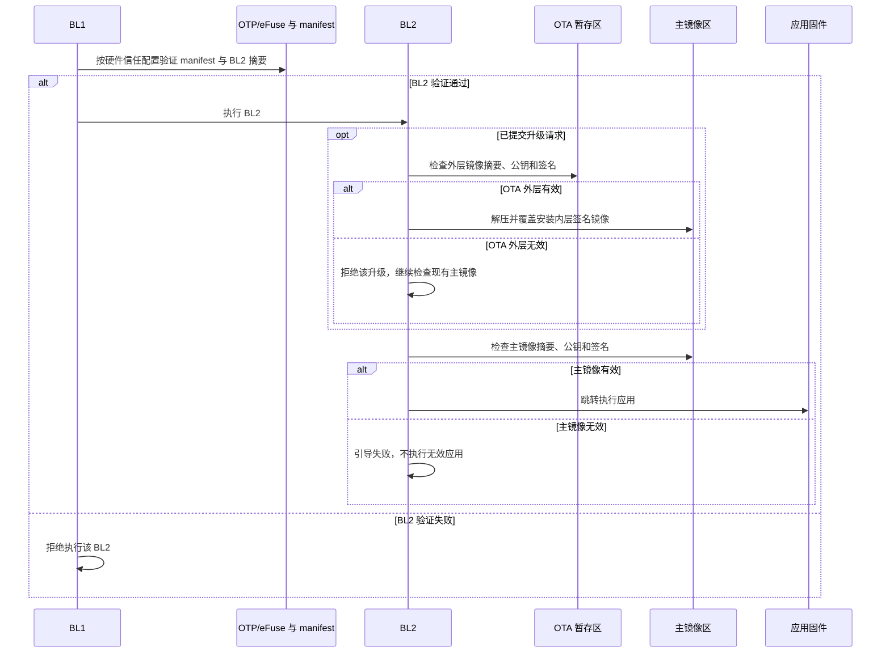

# 安全启动：AWS KMS 签名与设备验签

本项目采用 **AWS KMS 保存签名私钥、构建端请求签名、设备端使用可信公钥离线验签** 的方案。签名算法为 ECDSA P-256 + SHA-256，适用于 BK7239N、无 TF-M、独立 BL2 和覆盖式 OTA。

本文按当前预研项目的代码与配置归纳系统边界、签名对象、启动信任链和操作入口，面向方案汇报及后续开发维护。

## 1. 构建、签名与设备交互



构建主机持有公钥和 KMS 签名器配置，通过 AWS CLI 的身份凭据调用签名服务。当前适配器上传的是 32 字节摘要，固件正文由本地工具处理；设备运行期间不需要 AWS 凭据，也不调用 KMS。

KMS 非对称密钥的公钥可以导出，私钥由 KMS 管理；导出的公钥可在 AWS 之外验证签名。项目正是使用这一能力完成构建端与设备端的本地验签。[AWS KMS 非对称密钥说明](https://docs.aws.amazon.com/kms/latest/developerguide/symmetric-asymmetric.html)

### 1.1 当前能力范围

| 项目 | 当前配置与作用 |
| --- | --- |
| 签名算法 | ECDSA P-256 / `secp256r1`，SHA-256 |
| KMS 请求 | `SigningAlgorithm=ECDSA_SHA_256`，`MessageType=DIGEST` |
| 密钥组织 | 主、备 BL1 manifest、应用内层镜像和 OTA 外层镜像共用当前配置的一把 KMS 密钥 |
| 启动链 | BL1 验证保护 BL2 的 manifest；BL2 验证应用镜像 |
| BL2 公钥来源 | 编译到 BL2 中的固定 SubjectPublicKeyInfo DER 公钥 |
| OTA | `OVERWRITE_ONLY`，压缩外层与应用内层分别签名 |
| Flash 内容加密 | 关闭，`flash_aes_type=NONE`；签名提供来源与完整性校验 |
| Flash CRC | 开启，用于平台存储格式及错误检测，不能替代签名 |
| 公钥更新、备份公钥 | 关闭 |
| BL2 随应用升级 | 关闭 |
| 防回退 | 关闭；版本号和安全计数器字段存在不代表已经启用防回退 |

## 2. 构建端与设备端职责

构建端由 Makefile、Python 打包程序、AWS CLI 和平台二进制工具协作完成。设备端由芯片启动代码 BL1、独立 BL2、应用固件顺序执行；OTP/eFuse 提供硬件信任配置，Flash 存放 manifest、BL2 和应用镜像。

| 所在位置 | 组件 | 职责与代码入口 |
| --- | --- | --- |
| 构建端 | 构建入口 | [Makefile](../build_tool/Makefile) 组装私有项目，应用 `sonoff_modify` 覆盖，调用 SDK 构建 |
| 构建端 | 安全打包调度 | [PackAll](../bk_openthread/bk_idk/tools/env_tools/bksecure/scripts/pack_all.py) 与 [PackJson](../bk_openthread/bk_idk/tools/env_tools/bksecure/scripts/pack_json.py) 按 CSV 和 `pack.json` 生成镜像 |
| 构建端 | KMS 签名器 | [AwsKmsKey](../build_tool/ota/aws_kms.py) 校验配置、请求签名并本地验签 |
| 构建端 | 密钥加载适配 | [keys.load](../sonoff_modify/idk_modify/tools/env_tools/bksecure/tools/mcuboot_tools/imgtool/keys/__init__.py) 将 `.json` 签名器配置加载为 `AwsKmsKey` |
| 构建端 | BL1 manifest 签名 | [bl1_sign.py](../sonoff_modify/idk_modify/tools/env_tools/bksecure/scripts/bl1_sign.py) 导出 manifest 摘要、请求 KMS、回填签名并验签 |
| 构建端 | 应用 / OTA 镜像签名 | [imgtool/image.py](../sonoff_modify/idk_modify/tools/env_tools/bksecure/tools/mcuboot_tools/imgtool/image.py) 组装镜像头及 TLV，调用签名器 |
| 构建端 | BL2 公钥生成 | [convert_sign.py](../build_tool/ota/convert_sign.py) 将配置公钥转换为 BL2 的 C 数组 |
| 设备端 | BL1 | 按硬件安全启动配置验证 manifest 及其中记录的 BL2 内容 |
| 设备端 BL2 | 公钥选择 | [ow_pubkey.c](../sonoff_modify/idk_modify/components/bk_mcuboot/bl2/components/mcuboot/src/ow_pubkey.c) 的 `bk_find_key()` 检查镜像公钥是否匹配固定公钥 |
| 设备端 BL2 | 镜像验签 | [image_validate.c](../bk_openthread/bk_idk/components/bk_mcuboot/bl2/components/mcuboot/bootutil/src/image_validate.c) 验证镜像摘要和 ECDSA 签名 |
| 设备端 BL2 | 覆盖安装 | [ow_loader.c](../bk_openthread/bk_idk/components/bk_mcuboot/bl2/components/mcuboot/src/ow_loader.c) 与 [decompress_bl2.c](../bk_openthread/bk_idk/components/bk_mcuboot/bl2/components/mcuboot/src/decompress_bl2.c) 验证 OTA 外层、解压覆盖、验证主镜像 |

KMS 签名实现、公钥转换脚本和离线测试集中在 `build_tool/ota/`，签名配置与公钥位于 `build_tool/sign/`。Makefile 将 `build_tool/ota/` 加入 `PYTHONPATH`，供 SDK 的签名子进程加载。SDK 所需的加载入口与镜像处理适配位于 `sonoff_modify/idk_modify/`；构建时应用覆盖，退出时恢复 SDK。`aws_kms.py` 本身不复制到 SDK 中。

## 3. 密钥、公钥与信任关系

### 3.1 配置文件之间的关系

| 文件 | 内容 | 使用方 |
| --- | --- | --- |
| [security.csv](../build_tool/config/bk7239n/secure/security.csv) | 安全启动、算法、Flash CRC/AES、公钥路径、签名器配置路径 | SDK 安全构建与打包 |
| [aws_kms_signer.json](../build_tool/sign/aws_kms_signer.json) | provider、完整 Key ARN、region、profile、公钥文件路径 | `AwsKmsKey` |
| [aws_kms_public.pem](../build_tool/sign/aws_kms_public.pem) | KMS 公钥的 PEM 副本 | 构建端验签、镜像公钥 TLV、公钥头文件生成 |
| [sonoff_trusted_pubkey.h](../sonoff_modify/idk_modify/components/bk_mcuboot/bl2/components/mcuboot/src/sonoff_trusted_pubkey.h) | `TRUSTED_PUBKEY_DER` 固定公钥数组 | BL2 的 `bk_find_key()` |
| 构建产物 `otp_efuse_config.json` | 平台格式的信任根摘要、安全开关及生命周期配置 | 硬件部署工具 |

`security.csv` 中名称为 `img_sign_privkey` 的字段，当前填写的是 **KMS 签名器 JSON 文件名**，不包含私钥，也不直接填写 ARN。公钥与签名配置分别填写 `aws_kms_public.pem`、`aws_kms_signer.json`。安全构建将 `build_tool/sign/` 中的 PEM、JSON 文件复制到生成的项目配置目录，再由 SDK 复制到预构建和打包目录，按相对文件名读取。JSON 中的 `public_key` 相对于该 JSON 所在目录解析；`convert_sign.py` 从项目的 `build_tool/sign/` 读取配置指定的公钥。源码配置不依赖本机用户目录，不展开 `~` 或 shell 变量。

当前签名器使用区域 `ap-southeast-2` 和 profile `firmware`，Key ARN 以配置文件为准。适配器要求完整的 `key/...` ARN、ARN 区域与 `region` 一致、公钥曲线为 P-256。

### 3.2 公钥编码

BL2 固定公钥、镜像携带的公钥和签名器本地公钥必须表示同一把密钥。比较使用 **SubjectPublicKeyInfo DER 字节**，不能直接拿 PEM 文本或 65 字节的裸 EC 公钥代替。

本次核对的公钥 DER 长度为 **91 字节**，SHA-256 指纹为：

```text
829cc9e6cd97319299731dbc40f06cc7aafbf0fa9253f913ace3d1dfd9b0fafd
```

该指纹用于核对公钥文件。BL1 信任根摘要由平台 `secure_boot_tool` 生成，配置输出还涉及字节序转换；应使用 [rotpk_hash.py](../bk_openthread/bk_idk/tools/env_tools/bksecure/scripts/rotpk_hash.py) 的配套结果，不能把上面的指纹直接当作 OTP 烧录数据。

### 3.3 信任链



这条链以硬件信任根和安全启动设置正确部署为前提。BL2 内嵌公钥随 BL2 一起受 BL1 保护；如果硬件没有限制可执行的 BL2，仅在 BL2 中加入公钥比较不能建立完整的启动信任链。

## 4. 构建端怎样签名

### 4.1 摘要与签名约定

```text
M = 镜像格式规定的待签内容
D = SHA256(M)，32 字节二进制
S = KMS.Sign(KeyArn, ECDSA_SHA_256, DIGEST, D)
```

对于应用和 OTA 外层，`M` 包含镜像头、镜像载荷和受保护 TLV；不能只对原始 `app.bin` 计算摘要。`AwsKmsKey.sign(M)` 在本地计算一次 SHA-256，`sign_digest(D)` 则直接使用已经得到的 32 字节摘要。

`DIGEST` 表示已经完成摘要计算；在当前 ECDSA 算法下，KMS 不再对输入重复哈希。AWS CLI 应答中的 `Signature` 是 Base64 编码的 ECDSA DER 签名。[AWS KMS Sign](https://docs.aws.amazon.com/kms/latest/APIReference/API_Sign.html)

当前接入使用正常 `PackAll` / imgtool 的 `sign` 路径。SDK 独立 `action_type="hash"` 分支会对已有镜像摘要再次哈希，该输出不属于当前 KMS 签名接口的输入约定。

### 4.2 应用与 OTA 外层签名



本地验证摘要时使用 `Prehashed(SHA256)`，与 `MessageType=DIGEST` 对齐。适配器会检查应答中的 `KeyId` 和 `SigningAlgorithm`，还会实际验证签名；仅收到 KMS 成功应答不作为最终通过条件。

签名器进程超时为 120 秒，AWS CLI 连接、读取超时分别为 10 秒和 60 秒。AWS 调用失败、无效回包、公钥不匹配或密码学校验失败均抛出异常，没有本地私钥回退路径。

### 4.3 BL1 manifest 签名

BL1 需要的平台 manifest 格式由 `secure_boot_tool` 负责生成，KMS 适配只接管签名部分：

1. 使用配置公钥和 `bl2.bin` 生成 manifest 及其待签摘要，检查公钥与 KMS 签名器一致。
2. 将工具导出的摘要解码为 32 字节，调用 `AwsKmsKey.sign_digest()`；签名器先在本地验证 KMS 回包。
3. 将 ECDSA DER 签名解码成整数 `r`、`s`，写入 `bl1_signature.txt`。当前工具要求先 `r` 后 `s`，各占一行 64 位十六进制文本。
4. 调用 `sign_from_sig` 生成最终 manifest。manifest 末尾为两个 32 字节大端整数 `r || s`。
5. 从最终 manifest 取回签名，对除最后 64 字节之外的 manifest 内容再次验签，确认回填结果。

主、备 manifest 分别执行上述过程，二者都描述当前 BL2。它们不是两个应用分区，也不表示引入 TF-M。

## 5. 签名产物与 OTA 层次

生成关系由 [pack.json](../build_tool/config/bk7239n/secure/pack.json)、[PackBl2sign](../bk_openthread/bk_idk/tools/env_tools/bksecure/scripts/pack_bl2_sign.py) 和 [PackRawOta](../bk_openthread/bk_idk/tools/env_tools/bksecure/scripts/pack_raw_ota.py) 定义。

| 产物 | 内容与用途 | 验证方 |
| --- | --- | --- |
| `primary_manifest.bin`、`secondary_manifest.bin` | 包含 BL2 的描述、摘要及 manifest 签名 | BL1 |
| `bootloader.bin` | `bl1_control.bin`、`boot_flag.bin`、主/备 manifest、`bl2.bin` 的烧录封装 | 启动时由 BL1 验证其中的 BL2 |
| `app_signed.bin` | `overwrite.bin` 对应的签名应用镜像及工具打包描述 | BL2 |
| `all-app.bin` | `partition.bin` 与 `app_signed.bin` 的应用烧录封装 | 应用镜像由 BL2 验证 |
| `ota.bin` | BK OTA 包头、镜像描述及签名后的压缩载荷 | BL2 验证外层和解压后的内层 |
| `otp_efuse_config.json` | 硬件安全配置及根公钥摘要的工具输出 | 由部署流程核对并使用 |

`bootloader.bin` 与 `all-app.bin` 是配套的启动、应用烧录包；当前 `all-app.bin` 不包含完整启动包。`cpu0_app.bin` 和 `overwrite.bin` 属于构建中间产物。

OTA 的逻辑结构如下，具体填充、工具头和 Flash CRC 由 SDK 打包处理：

```text
ota.bin
├─ BK OTA 全局头和镜像描述
└─ 外层签名镜像
   ├─ 外层镜像头
   ├─ 压缩载荷
   │  └─ 解压后：内层签名应用镜像
   │     ├─ 应用镜像头与应用载荷
   │     ├─ 受保护 TLV，包含发布公钥等信息
   │     └─ SHA-256、KEYHASH、ECDSA 签名等 TLV
   ├─ 外层受保护 TLV
   └─ 外层 SHA-256、KEYHASH、ECDSA 签名等 TLV
```

内层签名保护最终安装和执行的应用，外层签名保护升级时处理的压缩镜像。BK 包头的 CRC、传输校验与镜像数字签名承担不同职责。

Matter 升级档在这个 `ota.bin` 外再封装 Matter 头；移除 Matter 头后，与 HTTP 等渠道使用的基础包相同。多渠道一键打包脚本尚待整理；HTTP/Matter 对新安全包的完整接收适配及板端升级验证见 [OTA 文档](ota.md)，不能仅凭签名包生成成功判断渠道已可用。

## 6. 设备端怎样验签

### 6.1 BL2 的三个检查条件

| 检查 | 实现要点 | 解决的问题 |
| --- | --- | --- |
| 镜像摘要 | 重算镜像头、载荷及受保护 TLV 的 SHA-256，与镜像声明值比较 | 内容是否完整、一致 |
| 公钥绑定 | `bk_find_key()` 将镜像公钥与 `TRUSTED_PUBKEY_DER` 比较 | 是否使用本项目认可的发布公钥 |
| 数字签名 | `bootutil_verify_sig()` 用已选公钥验证镜像摘要的 ECDSA 签名 | 内容是否由相应私钥签署 |

当前 Beken 路径使用镜像自定义公钥 TLV `0xA0`。`bk_find_key()` 先清空已有 key slot 状态，再检查指针、长度和完整 DER 内容；只有匹配后才选择 key slot 0。返回 `0` 表示公钥选择成功，后续签名验证仍必须成功。

因此，攻击者用另一把密钥对修改后的镜像重新签名，即使该签名自身有效，也会在公钥绑定检查失败后无法通过整体镜像验证。

### 6.2 启动与升级



图中省略 Flash 写入和解压失败的底层恢复分支。`OVERWRITE_ONLY` 不提供 A/B 应用试运行回退；`CONFIG_OTA_CONFIRM_UPDATE` 在当前路径中表示重启前提交升级请求，不是业务健康检查后的试运行确认。

## 7. 配置与使用入口

### 7.1 固件与打包配置

当前 [产品 config](../build_tool/config/bk7239n/config) 的关键项如下：

```ini
CONFIG_SECURITY_FIRMWARE=y
CONFIG_TFM=n
CONFIG_BL2=y
CONFIG_BL2_UPGRADE_STRATEGY="OVERWRITE_ONLY"
CONFIG_VALIDATE_IMAGE=y
CONFIG_VALIDATE_IMAGE_HASH_ONLY=n
CONFIG_BL2_SKIP_VALIDATE=n
CONFIG_BL2_VALIDATE_ENABLED_BY_EFUSE=n
CONFIG_BK_OTA=y
CONFIG_BK_OTA_NEW_PACK_TOOL=y
CONFIG_OTA_HTTP=n
CONFIG_OTA_CONFIRM_UPDATE=y
CONFIG_OTA_UPDATE_PUBKEY=n
CONFIG_OTA_BACKUP_PUBKEY=n
CONFIG_BL2_UPGRADE_WITH_APP=n
CONFIG_ANTI_ROLLBACK=n
```

`CONFIG_SECURITY_FIRMWARE` 选择 SDK 安全构建入口；`CONFIG_BL2` 启用独立引导程序；关闭 HASH_ONLY 和 SKIP_VALIDATE，保证配置要求完整镜像签名验证。`CONFIG_OTA_HTTP=n` 关闭 SDK 自带 HTTP OTA，不代表关闭 Sonoff 的 HTTP 升级入口。

`security.csv` 配置 `bl1_secureboot_en=TRUE`、`flash_crc_en=TRUE`、`flash_aes_type=NONE`、`img_sign_key_type=ec256`，公钥和签名器路径分别指向 `aws_kms_public.pem` 与 `aws_kms_signer.json`。

[ota.csv](../build_tool/config/bk7239n/secure/ota.csv) 设置 `strategy=OVERWRITE`、`encrypt=FALSE`、`bootloader_ota=FALSE`；[bin.csv](../build_tool/config/bk7239n/secure/bin.csv) 只声明 `bl2.bin` 和 `cpu0_app.bin`。镜像打包版本与安全计数器应按这两份文件核对，不能将应用的 Matter 版本字段直接当作签名镜像版本。

### 7.2 环境、身份与公钥准备

构建使用 Python 3.10 或兼容版本，并安装 [bksecure 依赖](../bk_openthread/bk_idk/tools/env_tools/bksecure/requirements.txt) 和 [Matter 构建依赖](../bk_openthread/components/matter/connectedhomeip/scripts/setup/requirements.build.txt)。已有满足依赖的环境可直接使用；需要新环境时，在项目根目录执行：

```bash
python3.10 -m venv build_tool/python-env
source build_tool/python-env/bin/activate
python -m pip install \
    -r bk_openthread/bk_idk/tools/env_tools/bksecure/requirements.txt \
    -r bk_openthread/components/matter/connectedhomeip/scripts/setup/requirements.build.txt
python -m pip check
```

签名使用可访问配置密钥的 `firmware` profile，调用方需具有该密钥的 `kms:Sign` 权限；导出公钥需要 `kms:GetPublicKey` 权限。KMS 密钥应为 `ECC_NIST_P256`、`SIGN_VERIFY` 且可用于签名。[AWS KMS Sign](https://docs.aws.amazon.com/kms/latest/APIReference/API_Sign.html)、[GetPublicKey](https://docs.aws.amazon.com/kms/latest/APIReference/API_GetPublicKey.html)

AWS CLI v2 控制台登录方式要求 2.32.0 或更新版本；使用该身份方式时，可在自己的终端执行以下命令。采用其他身份方式的环境沿用其 profile 登录流程。[AWS CLI 登录说明](https://docs.aws.amazon.com/cli/latest/userguide/cli-configure-sign-in.html)

```bash
aws login --profile firmware --region ap-southeast-2 --remote
aws sts get-caller-identity --profile firmware --region ap-southeast-2 --no-cli-pager
```

BL2 公钥头文件已经存在，正常构建无需重新生成。初次生成的入口是 `python build_tool/ota/convert_sign.py`；确需按当前公钥重新生成时使用 `--replace`。该脚本只更新构建侧头文件，不写入设备 OTP/eFuse。

### 7.3 构建与离线检查

在已准备好 Python 环境和 AWS profile 的终端，从项目根目录执行：

```bash
make -C build_tool MODEL=onoff_plug SECURE=1 SOC=bk7239n
```

安全构建产物目录是 `build/secure/bk7239n/onoff_plug/package/`。Makefile 自动设置签名脚本的 `PYTHONPATH`，打包时执行 KMS 签名，不需要手工向镜像末尾追加签名，也不需要单独运行分步摘要回填命令。

Makefile 和脚本根据自身位置定位项目目录；更换源码目录后应重新构建，生成新的配置和路径。新编译环境仍需安装工具链、Python 依赖和 AWS CLI，并配置签名所用的 AWS profile。原厂 SDK 默认工具链目录为 `/opt/gcc-arm-none-eabi-10.3-2021.10/bin`，安装位置不同时需要配置工具链路径。

签名适配器的离线测试入口如下，测试用桩替换 AWS CLI 调用：

```bash
python build_tool/ota/test_aws_kms_sign.py
```

该测试覆盖摘要只计算一次、AWS 调用失败、错误密钥签名、应答 Key ARN/算法不符、摘要长度错误和公钥曲线错误，并验证普通/安全构建的脚本导入路径、PEM 密钥加载、应用镜像签名验签和 BL1 主备 manifest 签名。迁移测试将项目复制到新目录，从其他工作目录验证配置准备、公钥转换、OTA 加密封装及 Matter 打包与提取。SDK 工具复制到临时目录执行，AWS CLI 调用由离线签名桩替代。

## 8. 硬件部署与当前验证范围

**`bl1_secureboot_en=TRUE` 是生成配置，不会自动烧录硬件信任根。** 当前 [gen_otp.py](../bk_openthread/bk_idk/tools/env_tools/bksecure/scripts/gen_otp.py) 在安全启动路径中将 `bl1_rotpk_hash`、`bl2_rotpk_hash` 和 `LCS` 的写入项设为 `status=false`；本次检查现有 package 输出也是如此。

设备部署需核对实际 BK7239N 的 OTP/eFuse 定义、信任根摘要格式、烧录结果及安全启动状态。BL2 本方案的应用公钥选择依据是内嵌公钥，生成文件中出现 `bl2_rotpk_hash` 并不表示 `bk_find_key()` 会读取该 OTP 项。

| 检查范围 | 本次结果 / 状态 |
| --- | --- |
| KMS 签名适配器及脚本路径 | 11 项离线测试通过，包含项目目录迁移 |
| 公钥一致性 | `security.csv` 公钥、签名器公钥、BL2 固定公钥一致，均为 P-256、91 字节 SPKI DER |
| 构建、打包和 BL2 验签路径 | 已按当前源码与配置核对 |
| 真实 KMS 调用及完整固件重建 | 本次整理文档未重新执行 |
| OTP/eFuse 实际烧录及板端启动 | 待板端验证 |
| HTTP / Matter 安全 OTA 全流程 | 接收适配及板端验证仍需完成，详见 [ota.md](ota.md) |

板端验证应覆盖：正确镜像启动、错误发布公钥签名被拒绝、签名缺失或损坏被拒绝、BL2 或应用内容被篡改后被拒绝，以及正常升级与写入中断后的启动行为。构造签名负例时应保持包格式和非密码学 CRC 正确，以区分格式错误、CRC 错误和实际验签拒绝。
